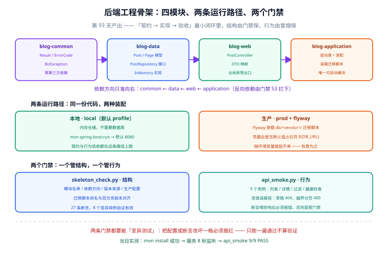

# 工程骨架与验收门禁

第 93 天（第 1 周）的产出：把 [接口契约](../Contract/index.md) 从「一纸 JSON」变成**能跑起来、能被门禁守住**的 Maven 多模块骨架，并跑通「契约 → 实现 → 验收」的最小闭环——`GET /api/v1/posts` 返回真实数据，草稿按契约返回 404。

一句话定位：这一页记录**骨架长什么样、为什么这样分层、怎么证明它是活的**。工程模板本身的通用约定（统一响应、TraceId、参数校验、CI 门禁）不在这里重复，去 [后端通用模板 · 骨架与目录结构](../../../Base/BackendTemplate/Skeleton/index.md)。



## 当日做了什么

1. **Maven 多模块骨架**（`service/`）：聚合 POM `blog-parent` 带四个子模块，四层单向依赖，唯一可启动模块 `blog-application`；
2. **两条运行路径**：`local`（内存仓储，无数据库也能跑完整链路）与 `prod + flyway`（Flyway 装载 `db/<vendor>/` 迁移脚本，凭据全走无默认值占位符）；
3. **两个零依赖门禁**：
   - `service/skeleton_check.py`：**结构**——27 条断言覆盖模块名单、依赖方向、版本来源、生产配置、迁移脚本命名与双方言对齐；
   - `service/api_smoke.py`：**行为**——9 个用例覆盖列表/详情/过滤/健康检查，并且**包含错误路径**（草稿 404、越界分页 400）；
4. **契约落成实现**：`PostController` 按契约实现读者端两条路径，`GlobalExceptionHandler` 把 `ErrorCode` 映射到标准 HTTP 状态码；
5. **两个坑的修复与留痕**：漏 `-parameters` 导致参数绑定全 500、默认 profile 缺失导致裸跑启动失败（详见「问题与决策」）。

## 工程结构

```text
project/Complete/BlogPlatform/
├─ api/                      # 第 92 天：契约（openapi.json + contract_check.py）
├─ db/                       # 第 91/92 天：双方言 DDL（mysql/ postgres/ parity_check.py）
└─ service/                  # 第 93 天：后端工程
   ├─ pom.xml                # 聚合 POM（blog-parent）：版本与插件版本的唯一来源
   ├─ skeleton_check.py      # 门禁①：结构
   ├─ api_smoke.py           # 门禁②：行为
   ├─ blog-common/           # 零依赖：Result / ErrorCode / BizException
   ├─ blog-data/             # 领域模型 + 仓储接口 + 内存实现（无框架注解）
   ├─ blog-web/              # Controller / DTO / 全局异常出口
   └─ blog-application/      # 启动类 + Bean 装配 + 迁移脚本装载（唯一可启动）
```

四个模块的职责与依赖方向：

| 模块 | 职责 | 允许依赖 | 关键类 |
| --- | --- | --- | --- |
| `blog-common` | 全站共用的响应外壳、错误码、业务异常 | 无（零第三方依赖） | `Result<T>`、`ErrorCode`、`BizException` |
| `blog-data` | 领域模型、仓储**接口**、仓储实现 | `blog-common` | `Post`、`Page<T>`、`PostRepository`、`InMemoryPostRepository` |
| `blog-web` | HTTP 入口、契约形状的 DTO、异常→状态码映射 | `blog-common`、`blog-data` | `PostController`、`GlobalExceptionHandler` |
| `blog-application` | 启动类、Bean 装配、资源装载 | `blog-common`、`blog-data`、`blog-web` | `BlogApplication`、`LocalRepositoryConfig` |

:::warning 说明
依赖方向是「只准向右」，由门禁 S3 强制：任何模块依赖更外层（尤其依赖可启动模块）都会被拦下。理由是**可启动模块必须是叶子**——否则单元测试一跑就把整个应用上下文拖起来，测试会慢到没人愿意写。
:::

## 三个关键决策

### 决策一：聚合 POM 自己当 parent，用 BOM import 管版本

不继承 `spring-boot-starter-parent`，而是 `dependencyManagement` 里 import `spring-boot-dependencies`。这样「版本从哪来」只有一处答案，也不会出现上游悄悄接管坐标的情况。

**代价必须说清楚**：`spring-boot-starter-parent` 顺带给了几个编译参数，自己当 parent 就都要自己补。第 93 天的第一个真实故障就出自这里：

```xml [service/pom.xml]
<plugin>
  <groupId>org.apache.maven.plugins</groupId>
  <artifactId>maven-compiler-plugin</artifactId>
  <version>3.14.1</version>
  <configuration>
    <release>${maven.compiler.release}</release>
    <!-- 继承 starter-parent 时这项由父 POM 给；自己当 parent 就得自己写 -->
    <parameters>true</parameters>
  </configuration>
</plugin>
```

### 决策二：迁移脚本只有一个来源，构建期复制进 classpath

`db/mysql|postgres/` 是 SQL 的**唯一来源**，`service/` 下不允许出现第二份（双份必然漂移）。构建时用 `maven-resources-plugin` 把当前方言的那份复制进 classpath：

```xml [service/blog-application/pom.xml]
<plugin>
  <groupId>org.apache.maven.plugins</groupId>
  <artifactId>maven-resources-plugin</artifactId>
  <!-- 版本由父 POM 的 pluginManagement 给，这里不写 -->
  <executions>
    <execution>
      <id>copy-db-migrations</id>
      <phase>process-resources</phase>
      <goals><goal>copy-resources</goal></goals>
      <configuration>
        <outputDirectory>${project.build.outputDirectory}/db/migration/${blog.db.vendor}</outputDirectory>
        <resources>
          <resource>
            <directory>${project.basedir}/../../db/${blog.db.vendor}</directory>
            <includes><include>V*.sql</include></includes>
          </resource>
        </resources>
      </configuration>
    </execution>
  </executions>
</plugin>
```

切换方言只改一个属性：`mvn install -Dblog.db.vendor=postgres`。门禁 S6 检查的就是这条链路（插件在不在、来源与输出去向对不对、有没有绑到 `process-resources`）。

### 决策三：数据层框架无关，装配只在 application 层

`InMemoryPostRepository` **刻意不加任何 Spring 注解**，Bean 注册放在 `blog-application` 的配置类：

```java [service/blog-application/src/main/java/com/blog/config/LocalRepositoryConfig.java]
@Configuration
@Profile("local")
public class LocalRepositoryConfig {
    @Bean
    public PostRepository postRepository() {
        return new InMemoryPostRepository();
    }
}
```

好处：换实现（内存 → JDBC → ORM）不牵动上层一行代码，数据层也能脱离 Spring 单独测。代价：**「用哪个实现」这件事必须在装配层显式写出来**，漏了就会在启动时报「找不到 Bean」。

## 如何验证

### ① 结构门禁（不需要数据库、不需要起服务）

```shell
cd project/Complete/BlogPlatform/service
python skeleton_check.py
# 期望：checks = 27  failed = 0 → RESULT: PASS
```

### ② 行为门禁（需要先起服务）

```shell
# 起服务：默认 profile 是 local，用内存仓储，不需要数据库
cd service && export SERVER_PORT=18080
mvn install -DskipTests && cd blog-application && mvn spring-boot:run
# 期望日志：Tomcat started on port 18080 / Started BlogApplication in X seconds

# 另开一个终端
cd service && python api_smoke.py --base http://127.0.0.1:18080
# 期望：cases = 9  passed = 9  failed = 0 → RESULT: PASS
```

当日实测结果（Windows + JDK 25 + Maven 3.9.5）：

```text
mvn install -DskipTests             → BUILD SUCCESS（四个模块全部 SUCCESS）
BlogApplication 启动                 → 8 秒后端口监听成功
python api_smoke.py                 → cases = 9  passed = 9  failed = 0  → PASS
python skeleton_check.py            → checks = 27  failed = 0            → PASS
python skeleton_check.py --selftest → selftest: 8/8 通过
python api_smoke.py --selftest      → selftest: 9/9 通过
```

`api_smoke.py` 的 9 个用例：

| 用例 | 期望 | 验的是什么 |
| --- | --- | --- |
| 列表只返回已发布文章 | 200 / total=3 / 首条为最新 | 草稿不进列表、默认排序正确、列表项不泄漏正文 |
| 详情返回渲染后的 HTML | 200 / 有 `contentHtml` | 读者端拿不到 `contentMd` |
| 草稿一律 404 | 404 / code=2001 | **不暴露存在性**（业务决策，不是技术限制） |
| 不存在的 slug 与草稿同码 | 404 / code=2001 | 两种「取不到」不可区分，否则等于探测接口 |
| `size=51` 必须 400 | 400 / code=1002 | 不得把越界值悄悄截断成 50 |
| `page=0` 必须 400 | 400 / code=1002 | 同上 |
| `tagSlug` 过滤生效 | 200 / total=1 | 过滤条件真的下推到了数据层 |
| `categorySlug` 过滤生效 | 200 / total=1 | 同上 |
| actuator 健康检查 | 200 / `status=UP` | 进程活着且依赖可用 |

### ③ 门禁自身有效吗？用变异法证

**只跑一遍通过不算验证**——恒真的断言和对的断言在输出上长得一模一样。所以两个门禁都内置了 `--selftest`：

```shell
python skeleton_check.py --selftest   # 把 8 条规则各故意改坏一次，确认都能报红
python api_smoke.py --selftest        # 把每条断言喂空响应，确认至少有一条会报错
```

```text
=== skeleton_check 变异自测 ===
  PASS  modules 少写一个            命中规则=['S1']
  PASS  子模块自带 version          命中规则=['S2']
  PASS  插件自带 version           命中规则=['S2']
  PASS  反向依赖                   命中规则=['S3']
  PASS  双方言迁移版本不一致         命中规则=['S4']
  PASS  生产配置明文密码             命中规则=['S5']
  PASS  凭据给了默认值               命中规则=['S5']
  PASS  资源复制指向错误目录          命中规则=['S6']
selftest: 8/8 通过
```

## 问题与决策

第 93 天踩了两个**编译期完全正常、运行期才炸**的坑，两个都不是 Maven 的问题，而是「自己当 parent」与「profile 语义」的连带成本：

| 问题 | 现象 | 根因 | 决策 |
| --- | --- | --- | --- |
| 接口全部返回 500（code 5001） | 六个用例全挂，**日志里没有任何异常** | 漏了 `-parameters` 编译参数，Spring 反射拿不到参数名，无法绑定 `@RequestParam` | 在父 POM 显式开 `<parameters>true</parameters>` 并加注释说明来源；同时给兜底异常处理器补 `log.error` |
| 裸跑 `mvn spring-boot:run` 启动失败 | `required a bean of type 'PostRepository' that could not be found` | 仓储实现挂在 `@Profile("local")` 上，不带任何 profile 启动时该 Bean 不注册 | `application.yml` 加 `spring.profiles.default: local`——「不带参数」的语义应当是「本地跑」 |
| `mvn -o` 离线构建失败 | `asm:9.8`、`plexus-java:1.5.0` 报 "present, but unavailable" | 本地仓库有构件但缺来源仓库元数据 | 首次构建联网；离线构建能力留到 CI 镜像预热阶段再解决 |
| 根目录执行 `-pl blog-application -am spring-boot:run` 失败 | `Unable to find a suitable main class` | 解析为聚合 POM 的执行目标 | 先 `mvn install`，再进 `blog-application/` 单独 `spring-boot:run`；文档里按这个顺序写 |
| 门禁把插件 `<version>` 误判为违规 | `[S2] blog-application 自带 <version>：['3.5.0']` | 检查口径把 `build/plugins` 下的版本也算进「子模块自带版本」 | **不改门禁口径，改工程**：插件版本收进父 POM 的 `pluginManagement`；门禁同时细化为区分「依赖版本 / 插件版本」并补一条变异用例 |

:::danger 注意
两个坑的共同教训：**「编译通过」证明不了「跑得起来」**。

1. 自己当 parent 时，`spring-boot-starter-parent` 顺带提供的编译参数不会跟过来，`-parameters` 只是其中一项。要么显式补，要么把 starter-parent 加回来。
2. 兜底异常处理器**必须打日志**。第 93 天第一版只返回统一响应、不记录异常，结果就是「接口返回 5001，日志里什么都没有」——兜底处理器不打日志，等于把证据一起吞了。
3. 门禁报错时先问一句「是代码错了还是门禁口径错了」。这次是**两边都要动**：工程按 Maven 纪律修正，门禁也把输出改准（原来 OK 的行打印的是失败措辞，读起来正好相反）。
:::

## 与既有资产的分工边界

| 内容 | 在哪 | 为什么 |
| --- | --- | --- |
| 统一响应 / 全局异常 / TraceId / 参数校验的**通用做法** | [后端通用模板](../../../Base/BackendTemplate/index.md) | 那些是跨项目复用的模板能力，本项目只写业务层 |
| 本项目的**分层裁剪结果**与两个门禁 | 本页 | 裁剪是项目决策：四模块而不是模板的三模块，因为要把「可启动模块」单独隔开 |
| 双方言 DDL 与 parity 门禁 | [接口契约](../Contract/index.md) | 第 92 天产出，属 db 层 |
| 第 2 周的业务编码（文章 CRUD、渲染管线） | [进展记录](../Progress/index.md) | 从第 94 天开始 |

## 下一步（第 94 天）

1. **把仓储换成真库**：按 `db/mysql/V1__blog_init.sql` 接入 JDBC 实现，`local` 路径保留作为测试夹具；用 `-Pflyway` 装载迁移脚本，验证 `db/migration/mysql/V1__blog_init.sql` 能真正建出 7 张表；
2. **补契约测试**：把 `api_smoke.py` 的 9 个用例上移成 MockMvc 集成测试（复用 [模板的 MockMvc 集成测试](../../../Base/BackendTemplate/IntegrationTest/index.md) 写法），让契约断言进 `mvn test`；
3. **管理端写接口**：按契约实现 `POST /api/v1/admin/posts`，跑通「写 → 渲染 → 读」这条链路。

## 参考资料

- [Maven · Introduction to the POM](https://maven.apache.org/guides/introduction/introduction-to-the-pom.html)
- [Maven · Guide to Working with Multiple Modules](https://maven.apache.org/guides/mini/guide-multiple-modules.html)
- [Spring Boot · Build Systems（BOM 用法）](https://docs.spring.io/spring-boot/reference/using/build-systems.html)
- [Spring Boot · Profiles（`spring.profiles.default` 语义）](https://docs.spring.io/spring-boot/reference/features/profiles.html)
- [Maven Compiler Plugin · `parameters`](https://maven.apache.org/plugins/maven-compiler-plugin/compile-mojo.html)
- [Flyway · Migrations 命名规则](https://documentation.red-gate.com/flyway/reference/migrations)
