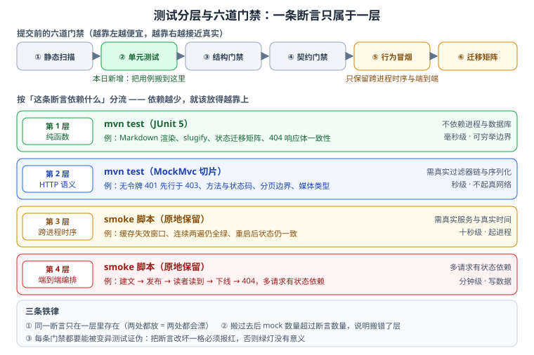

# 测试分层收口：把用例上移到 `mvn test`

第 2 周的验收判据是「服务可启动、接口可调用、后台页面可访问」，到第 102 天为止这五道门禁已经能证明这件事。但它们有一个共同的代价：**必须先把服务起起来、必须先写进去数据才能跑**——于是最该被反复跑的断言（渲染结果对不对、状态迁移合不合法、401 有没有先于 403）反而跑得最慢、最不容易在本地随手执行。这一节做的是收口：把「纯函数」与「HTTP 语义」这两类断言搬进 `mvn test`，把「跨进程时序」与「端到端编排」留在 smoke 脚本里。



::: info 本日为文档产出
沿用第 99 天起的口径：本页记录设计与判据，代码在你的工程里按本节内容创建。
:::

## 一、这一节解决什么问题

本日之前的验证链路是「五道行为门禁」，全部依赖一个正在运行的服务：

| 门禁 | 依赖 | 单次耗时量级 | 跑不起来的常见原因 |
| --- | --- | --- | --- |
| `skeleton_check.py`（结构） | 文件系统 | 秒 | 无 |
| `api_smoke.py`（只读行为） | 运行中的服务 | 十秒 | 服务没起 |
| `admin_smoke.py`（写链路） | 运行中的服务 + 可写环境 | 十秒 | 不敢对共享环境跑 |
| `lifecycle_smoke.py`（状态迁移） | 运行中的服务 + 可写环境 | 十秒 | 同上 |
| `visibility_smoke.py`（读侧可见性） | 运行中的服务 | 十秒 | 服务没起 |

问题不在「慢」，在于**因果顺序被颠倒了**：渲染器少转义一个字符、状态迁移矩阵漏了一条非法路径、鉴权链里 403 抢在 401 前面——这些都是**改一行代码就能引入、而只有跑到第十秒才知道错了**的缺陷。它们本该在保存文件后的三秒内被 JUnit 拦下来。

## 二、分层判据：一条断言该放哪一层

判据只有一条：**这条断言依赖什么？依赖越少，就该放得越靠上。**

| 断言对象 | 落在哪一层 | 为什么 | 失败时的信号 |
| --- | --- | --- | --- |
| 纯函数行为（Markdown 渲染、slug 生成、状态迁移矩阵、错误响应体的字段） | `mvn test` · 普通 JUnit | 不需要进程、不需要数据库、不需要时间，可以穷举边界 | 函数写错了 |
| HTTP 语义（401 先于 403、方法与状态码、分页边界、媒体类型、响应结构） | `mvn test` · MockMvc 切片 | 需要真实过滤器链与序列化，但不需要真网络与真库 | 契约实现写错了 |
| 跨进程时序（缓存失效窗口、连跑两遍仍一致、重启后状态） | smoke 脚本（保留） | 需要真实服务与真实时间，mock 出来的时序是假的 | 编排或时序写错了 |
| 端到端编排（建文 → 发布 → 读到 → 下线 → 404） | smoke 脚本（保留） | 多请求有状态依赖，拆开后失去意义 | 链路串错了 |
| 性能（延迟分位、吞吐） | 基准/压测，不进功能门禁（见 [高性能 Java](../../../../docs/Backend/HighPerformanceJava/index.md)） | 与正确性口径不同，混在一起两边都不可信 | 性能回归 |

::: danger 上移最容易犯的三个错
1. **把「多请求有状态依赖」的用例硬搬进单元测试**：为了让它跑起来，你会 mock 掉仓储、mock 掉时钟、mock 掉鉴权，最后断言的是「我的 mock 会不会被调用」——测试全绿而线上仍然错。判据很直接：**搬过去之后 mock 的数量超过断言的数量，说明搬错了层**。
2. **只搬容易搬的，把真正的分支留在 smoke**：覆盖率数字好看了，但 401/403/404 这些**安全相关分支**依然只在慢门禁里被覆盖，甚至漏测。上移清单必须按「风险」而不是按「难度」排。
3. **上移之后不删原来 smoke 里的重复用例**：同一断言躺在两处，改一处忘一处，最终两边互相漂移。**同一断言只存在于一层**。
:::

## 三、上移清单与保留清单

本日把第 100-102 天攒下来的用例按上表分流，逐条落位：

| 用例 | 原位置 | 现位置 | 理由 |
| --- | --- | --- | --- |
| Markdown 转义、表格列数不齐降级、引用块嵌套上限 | `visibility_smoke` 的间接覆盖 | `MarkdownRendererTest`（参数化） | 纯函数，边界应该穷举而不是抽检 |
| 中文 slug 生成、冲突追加序号、标点处理 | 无（只在手工验证里） | `SlugifyTest` | 纯函数，原本是覆盖盲区 |
| 状态迁移矩阵（4 动作 × 4 状态 = 16 格，含非法 409） | `lifecycle_smoke` 抽了 9 格 | `PostStatusTest`（`@CsvSource` 穷举 16 格） | 矩阵必须**穷举**，抽检等于没测 |
| 404 响应体逐字节一致（四种来源） | `visibility_smoke` 抽检 | `ArticleNotFoundExceptionTest` + MockMvc | 断言对象是响应体，不是时序 |
| 无令牌 401 / 格式错 401 / 验签失败 401 / 过期 401 | `auth_smoke` | `AuthFilterTest`（MockMvc） | 过滤器链行为，不需要真网络 |
| `VIEWER` 写文章 403、`EDITOR` 改分类 403、默认拒绝 | `auth_smoke` | `AuthzRulesTest`（MockMvc） | 同上；且 401/403 的先后顺序必须在这里钉死 |
| 分页边界（`size` 上限、`page` 起点、超范围返回空页） | `api_smoke` 部分覆盖 | `PaginationTest` | HTTP 语义 |
| 缓存失效窗口（提交后失效、两次 GET 都 404） | `visibility_smoke` **保留** | 不动 | 真实时序 |
| 连跑两遍仍全绿（可重复性） | 各 smoke **保留** | 不动 | 跨进程状态 |
| 建文 → 发布 → 读到 → 下线 → 404 全链路 | `lifecycle_smoke` **保留** | 不动 | 端到端编排 |

上移后的门禁数量不变（结构 / 契约 / 行为 / 迁移四道脚本 + 静态扫描），**新增的是一道真正快的门禁**：`mvn test`。它的价值不在于替代 smoke，而在于把「缺陷的发现时间」从十秒级压到三秒级。

## 四、`mvn test` 门禁怎么建

### 目录与命名

测试与被测类同包、同模块，避免为了「可测」把可见性放宽：

```text
service/
├─ blog-application/src/test/java/com/blog/
│  ├─ text/MarkdownRendererTest.java      # 纯函数
│  ├─ text/SlugifyTest.java               # 纯函数
│  ├─ domain/PostStatusTest.java          # 状态迁移矩阵
│  ├─ web/AuthFilterTest.java             # MockMvc 切片
│  ├─ web/AuthzRulesTest.java             # MockMvc 切片
│  └─ web/PaginationTest.java             # MockMvc 切片
└─ blog-common/src/test/java/com/blog/common/
   └─ api/ErrorResponseTest.java          # 错误响应体一致性
```

三条纪律与 smoke 脚本完全一致，**不因为进了 JUnit 就放松**：

1. **测试数据带随机位**。写库的用例用 `UUID.randomUUID()` 后缀做 slug；同秒内两遍撞 slug 的坑在第 98 天已经踩过一次，那次是 19 步级联失败而报错指向接口。
2. **断言相对基线，不写死绝对值**。分页用例断言「过滤前后 `total` 的差值等于被过滤掉的文章数」，而不是断言 `total == 7`。
3. **断言必须能被证伪**。每条 assert 都要回答「我改坏哪一行，它会红」；答不出来的断言删掉。

### 示例一：渲染器测试用参数化，把边界摊开

```java
// blog-application/src/test/java/com/blog/text/MarkdownRendererTest.java
class MarkdownRendererTest {

    private final MarkdownRenderer renderer = new MarkdownRenderer();

    @ParameterizedTest(name = "[{index}] {0}")
    @CsvSource({
        "'<script>alert(1)</script>', '&lt;script&gt;',     输入必须转义后再拼标签",
        "'**b**',                   '<strong>b</strong>',   行内语法正常",
        "'|a|b|\n|-|-|\n|1|',       '仅表头',               列数不齐整块降级",
        "'> 一层\n>> 二层',          '两层引用正常',          引用块 <= 3 层",
        "'> a\n>>> b\n>>>> c',      '超限截断',             优于渲染出四层残留",
    })
    void render_edges(String input, String expectedFragment, String why) {
        String html = renderer.render(input);
        assertThat(html).contains(expectedFragment);
    }
}
```

`why` 这一列不是装饰：它让「这条用例为什么存在」和用例本身写在同一个地方，**没有理由的用例应当在评审时被质疑**。

### 示例二：状态迁移矩阵必须穷举

```java
// blog-application/src/test/java/com/blog/domain/PostStatusTest.java
class PostStatusTest {

    // 16 格全列：DRAFT/PUBLISHED/OFFLINE/DELETED × publish/unpublish/revoke/delete
    @ParameterizedTest(name = "{0} --{1}--> {2} ({3})")
    @CsvSource({
        "DRAFT,     publish,   PUBLISHED, ok",
        "OFFLINE,   publish,   PUBLISHED, ok",
        "PUBLISHED, unpublish, OFFLINE,   ok",
        "OFFLINE,   revoke,    DRAFT,     ok",
        "DRAFT,     unpublish, DRAFT,     STATE_CONFLICT",
        "DRAFT,     revoke,    DRAFT,     STATE_CONFLICT",
        "PUBLISHED, publish,   PUBLISHED, STATE_CONFLICT",
        "DELETED,   publish,   DELETED,   STATE_CONFLICT",
        // ... 其余 8 格同理，一格都不省
    })
    void transition_matrix(String from, String action, String expectedStatus, String expectedOutcome) {
        Post post = givenPostIn(Status.valueOf(from));
        Result<Post> r = Actions.of(action).apply(post);
        assertThat(r.hasConflict()).isEqualTo(expectedOutcome.equals("STATE_CONFLICT"));
        assertThat(post.getStatus()).isEqualTo(Status.valueOf(expectedStatus));
    }
}
```

一条写进页面的方法论（第 100 天提出，这里用代码落地）：**非法迁移必须摆在正确的起点上测**。在 `PUBLISHED` 上测 `unpublish` 会得到 200——只有把起点摆到 `DRAFT` 上，那个 409 才是有效的用例；**起点错了，409 用例会假通过**。

### 示例三：401 与 403 的先后顺序在 MockMvc 里钉死

```java
// blog-application/src/test/java/com/blog/web/AuthFilterTest.java
@WebMvcTest(controllers = AdminPostController.class)
@Import({AuthFilter.class, AuthConfig.class})
class AuthFilterTest {

    @Autowired MockMvc mvc;

    @ParameterizedTest
    @CsvSource({
        "''",                                   // 不带 Authorization 头
        "'Bearer'",                              // 只有方案名
        "'Bearer not-a-jwt'",                    // 格式错
        "'Bearer eyJhbGciOiJIUzI1NiJ9.bad.sig'", // 验签失败
    })
    void missing_or_broken_token_is_401(String header) throws Exception {
        MockHttpServletRequestBuilder req = post("/api/v1/admin/posts");
        if (!header.isEmpty()) req = req.header("Authorization", header);
        mvc.perform(req.contentType(MediaType.APPLICATION_JSON).content("{}"))
           .andExpect(status().isUnauthorized())
           .andExpect(jsonPath("$.code").value("UNAUTHENTICATED"));
    }

    @Test
    void viewer_cannot_write_but_editor_can() throws Exception {
        // VIEWER 命中 403（身份已确认，只是没有权限）
        mvc.perform(post("/api/v1/admin/posts")
                .header("Authorization", "Bearer " + tokenOf(Role.VIEWER))
                .contentType(MediaType.APPLICATION_JSON).content("{}"))
           .andExpect(status().isForbidden())
           .andExpect(jsonPath("$.code").value("FORBIDDEN"));

        // EDITOR 通过（这里只断言不再被鉴权拦截，业务断言留给别的测试）
        mvc.perform(post("/api/v1/admin/posts")
                .header("Authorization", "Bearer " + tokenOf(Role.EDITOR))
                .contentType(MediaType.APPLICATION_JSON).content("{}"))
           .andExpect(status().isCreated());
    }
}
```

这条「**401 先于 403**」的顺序为什么必须在快门禁里钉死：它一旦被改反，攻击者就能用 403 与 401 的差别**枚举出哪些路径存在**——这是一个安全缺陷，不该等到十秒级的 smoke 才发现；而且它很容易被一次「统一异常处理」的重构顺手改坏。

### 依赖与数据策略

| 问题 | 决策 | 理由 |
| --- | --- | --- |
| 单元测试要不要起真库？ | **不起**，用 `local` profile 的内存仓储 | 与第 93 天的「两条运行路径」一致；真库路径由 flyway 迁移与双方言 parity 门禁覆盖 |
| 要不要引入 Testcontainers？ | 第 4 周部署阶段再评估 | 现在没有依赖数据库方言的断言；先别为一个用不到的隔离付出启动成本 |
| 时间相关断言怎么办？ | 依赖注入 `Clock`，测试传固定时钟 | 直接读 `System.currentTimeMillis()` 的代码无法稳定断言「保留 `publishedAt`、清空 `offlineAt`」 |
| 测试之间能不能共享数据？ | 不能，每个用例自建自清 | 共享夹具是「本地绿、CI 红」的常见来源 |

Surefire 建议配置（保证卡死时不会挂住流水线）：

```xml [pom.xml]
<plugin>
  <groupId>org.apache.maven.plugins</groupId>
  <artifactId>maven-surefire-plugin</artifactId>
  <configuration>
    <forkCount>2</forkCount>
    <reuseForks>true</reuseForks>
    <argLine>-Xmx512m</argLine>
    <!-- 单条用例超时 30s：挂住比失败更危险，会让流水线一直排队 -->
    <systemPropertyVariables>
      <junit.jupiter.execution.timeout.default>30s</junit.jupiter.execution.timeout.default>
    </systemPropertyVariables>
  </configuration>
</plugin>
```

## 五、顺手收口：分类与标签计数（第 102 天待办 ②）

第 102 天把「读者端只看得到 PUBLISHED」钉在读路径上，但它留下一个**管理端会看到、读者端看不到**的不一致：分类与标签的文章计数。口径必须与可见性一致，否则后台显示「分类：Java（12 篇）」，点进去只有 9 篇。

| 决策点 | 结论 | 理由 |
| --- | --- | --- |
| 计数口径 | **仅统计 `PUBLISHED`** | 与读者端列表使用同一条件，改一处即可对齐 |
| 计数在哪算 | 进 SQL（`GROUP BY category_id`）而非内存过滤 | 内存过滤在分页时会把 `total` 算错，第 102 天已踩过 |
| 什么时候更新 | 只读时实时统计，**不做冗余计数列** | 冗余列要靠状态迁移维护，一处漏减就永久错；当前数据量下实时 `GROUP BY` 成本可接受 |
| 是否需要缓存 | 列表页缓存命中时直接复用；不单独缓存计数 | 单独缓存会多一个失效入口，收益不成比例 |
| 用例放哪层 | `CategoryCountTest`（MockMvc + 内存仓储，可直接构造四种状态） | 断言对象是「查询结果」，属第 2 层 |

用例必须包含**迁移后计数会变**这一条，这是最容易漏的：

```java
@Test
void unpublish_decreases_category_count() throws Exception {
    long before = countOf("java");                 // 仅统计 PUBLISHED
    publish(slugOf("draft-1"));                    // DRAFT -> PUBLISHED
    assertThat(countOf("java")).isEqualTo(before + 1);
    unpublish(slugOf("draft-1"));                  // PUBLISHED -> OFFLINE
    assertThat(countOf("java")).isEqualTo(before); // 下线后必须减回去
}
```

## 六、六道门禁的顺序与信号

顺序不是随意的，它按「**越靠左越便宜**」排：左侧失败时右侧的问题根本还没机会出现，所以先跑左侧。

| 顺序 | 门禁 | 命令 | 失败说明什么 |
| --- | --- | --- | --- |
| ① | 静态扫描 | `mvn -q compile` + 结构检查 | 代码根本编译不过，别往下看了 |
| ② | **单元测试** | `mvn test -Dtest='MarkdownRendererTest,SlugifyTest,PostStatusTest,AuthFilterTest,AuthzRulesTest,PaginationTest,CategoryCountTest'` | 纯函数或 HTTP 语义写错了 |
| ③ | 结构门禁 | `python skeleton_check.py` | 模块划分/配置项不对 |
| ④ | 契约门禁 | parity / contract 检查 | 双方言 DDL 或契约漂移 |
| ⑤ | 行为冒烟 | `api_smoke.py` / `admin_smoke.py` / `visibility_smoke.py` | 跑起来的服务行为与设计不符 |
| ⑥ | 迁移矩阵 | `lifecycle_smoke.py` | 状态机在真实进程里的迁移与设计不符 |

一条纪律：**同一断言只在一个门禁里存在**。上移之后，smoke 脚本里对应的抽检用例要删掉而不是保留——否则你会得到两种失败信号指向同一处代码，修的时候两边都要改。

## 七、当日验收

```shell
# ① 先证门禁能被证伪：把断言改坏，它必须报红
#    把 PostStatusTest 里 "DRAFT, unpublish, DRAFT, STATE_CONFLICT" 改期望为 ok
mvn test -Dtest=PostStatusTest
# ✅ 期望：FAIL，且失败信息指向 DRAFT --unpublish--> 那一格（不是全类报错）

# ② 还原后全绿
mvn test
# ✅ 期望：Tests run: NN, Failures: 0, Errors: 0, Skipped: 0
#          BUILD SUCCESS，耗时在秒级（不起服务、不连数据库）

# ③ 第 2 周验收：五道既有门禁仍然全绿（顺序不能反，先起服务）
cd your-project/service && mvn install -DskipTests
cd blog-application && export SERVER_PORT=18080 && mvn spring-boot:run
# 另开终端：
python skeleton_check.py                             # 期望 checks = 27  failed = 0
python api_smoke.py        --base http://127.0.0.1:18080   # 期望 cases = 9   passed = 9
python admin_smoke.py      --base http://127.0.0.1:18080   # 期望 steps = 37  passed = 37
python lifecycle_smoke.py  --base http://127.0.0.1:18080   # 期望 steps = 24  passed = 24
python visibility_smoke.py --base http://127.0.0.1:18080   # 期望 steps = 22  passed = 22
```

第 2 周验收判据（本日达成）：**`mvn test` 秒级全绿，五道行为门禁仍全绿，且第 ① 步证明断言不是恒真**。

## 八、下一步

1. **第 104 天**：补完契约里 401/403 分支与分页边界的 MockMvc 用例（本日已建骨架，缺的是分支穷举），并把 `CategoryCountTest` 扩到标签维度；届时第 2 周完全收口。
2. **第 105 天起进入第 3 周**：评论模块——两级嵌套的数据结构、`@ResponseBody` 与审核状态、防刷与限流；随后是全文搜索（MySQL ngram 起步）与前台 SSR 联调。
3. **第 3 周的测试策略沿用本日分层判据**：评论树的构建是纯函数（上移 `mvn test`）、防刷限流是时序（留 smoke）。

## 相关章节

- [工程骨架与验收门禁](../Skeleton/index.md)：两条运行路径与前三道门禁的出处
- [文章写入链路](../WritePath/index.md)：管理端 CRUD 与发布状态机（`admin_smoke` 37 步）
- [文章下线动作](../Lifecycle/index.md)：四态迁移矩阵的设计（本日把它穷举进 `mvn test`）
- [可见性收敛](../Visibility/index.md)：读侧 404 一致性判据与用例分流口径
- [进展记录](../Progress/index.md)：本日的命令、输出与问题决策
- [完整项目交付 · 测试策略与门禁](../../../../docs/Others/ProjectDelivery/Testing/index.md)：分层职责边界的方法论来源
- [CI/CD · 自动化测试与质量门禁](../../../../docs/Tools/CICD/Testing/index.md)：把 `mvn test` 接进流水线的位置
