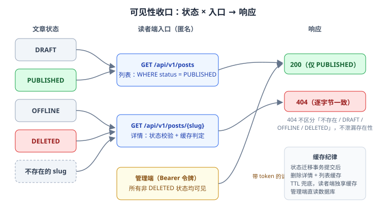

# 可见性收敛：读者端只看得到 PUBLISHED

本页是「全栈博客平台」第 102 天的构建步骤（周期 4 第 2 周 · 收尾）。任务来自第 100 天状态机留下的读侧收口：**状态机已经管住了「写」，本日管住「读」**——让读者端列表与详情对 `DRAFT` / `OFFLINE` / `DELETED` 一律 404，并补上读侧门禁 `visibility_smoke`。

::: warning 本页命令里的路径指「你自己的工程」
本仓是**文档库**，不存放代码。`service/`、`visibility_smoke.py` 等指**你按对应章节搭起来的工程与脚本**。本页的验收清单是**判据**，不是实测输出。
:::



## 一、当日做了什么

### 1.1 读侧收口：一条规则、两个入口

规则只有一条：**读者端（无令牌）能看到的文章，当且仅当 `status = PUBLISHED`**。落到两个入口：

| 入口 | 实现要求 | 非法状态的表现 |
| --- | --- | --- |
| `GET /api/v1/posts`（列表） | 查询条件里**必须带** `status = 'PUBLISHED'` | 非 PUBLISHED 根本不进结果集，`total` 不计 |
| `GET /api/v1/posts/{slug}`（详情） | 按 slug 查出后校验状态，非 `PUBLISHED` 走 404 | 与「slug 不存在」**完全相同**的响应 |

两条容易偷懒的反面写法，直接列进验收判据：

1. **「查出全部再在内存里过滤」不行**：列表分页的 `total`、页码都会算错——过滤掉 3 篇后每页少 3 条，读者会看到「有页无文」的空洞。过滤条件必须进 SQL。
2. **「详情先 302 到首页」不行**：跳转同样向读者确认了「这篇文章存在」，只是不给看。

### 1.2 为什么是 404，而不是 403 / 410

| 候选 | 语义 | 为什么不用 |
| --- | --- | --- |
| 403 Forbidden | 「存在，但你没权限」 | **泄漏存在性**：枚举 slug 即可探测草稿与待发布内容，编辑尚未发布的选题直接暴露 |
| 410 Gone | 「曾经存在，现已移除」 | 同样确认了存在性，且把「下线」与「删除」两种语义混在一起 |
| **404 Not Found** | 「没有这个东西」 | 与不存在的 slug 不可区分——**存在性不泄漏**是硬判据 |

判据可以写进测试：对同一个 slug 分别置于 `DRAFT` / `OFFLINE` / `DELETED`，外加一个从未存在过的 slug，**四个响应的状态码与响应体逐字节一致**（统一错误码 `ARTICLE_NOT_FOUND`，第 100 天契约已预留）。

### 1.3 缓存与状态迁移的先后顺序（接第 101 天待办）

第 101 天把渲染挂到了 `PUBLISHED` 转移上，本日回答它留下的读侧问题：**下线后的文章不能因缓存残留继续出现在读者端**。采用 cache-aside，纪律三条：

1. **失效时机挂在状态迁移上，与渲染同一批挂钩**：`publish` / `unpublish` / `delete` 三个动作在**事务提交后**删除该文的详情缓存与列表缓存（`publish` 后列表会变、`unpublish`/`delete` 后详情会变，宁多删不可漏删；删缓存是幂等操作，多删无代价）。
2. **先提交事务、再删缓存**，顺序不能反：先删后提交的窗口里，并发读会 miss 回库、把**旧状态**重新回填进缓存，下线操作等于白做。
3. **TTL 兜底**：详情缓存加短 TTL（如 60 秒）。失效逻辑有 bug 时，错误可见性最多存活一个 TTL——**正确性靠失效，止损靠 TTL**，两者都要有。

另外两条边界：

- **管理端不走读者缓存**：带令牌的管理读直连数据库，否则「作者刚下线文章、后台却还显示已发布」的错觉会出现。
- **`unpublish` 与 `delete` 后，已渲染的 `contentHtml` 留库不清**：它只是缓存性质的字段，重新发布时会被覆盖；删了反而丢「曾发布过」的审计线索（与第 100 天保留 `publishedAt` 的决策一致）。

### 1.4 读侧门禁：`visibility_smoke.py`

与既有门禁的分工（完整清单，含本日新增）：

| 门禁 | 管什么 | 用例数 | 是否有状态 |
| --- | --- | --- | --- |
| `skeleton_check.py` | **结构**（模块、依赖方向、配置、迁移命名） | 27 断言 | 否 |
| `api_smoke.py` | **只读行为**（列表、详情、过滤、健康检查 + 错误路径） | 9 用例 | 否 |
| `auth_smoke.py` | **认证鉴权**（401 先于 403、越权路径） | — | 是 |
| `admin_smoke.py` | **写链路**（创建 → 更新 → 发布 → 软删） | 37 步 | 是 |
| `lifecycle_smoke.py` | **状态迁移**（四态合法/非法路径 + 时间戳语义） | 24 步 | 是 |
| **`visibility_smoke.py`（本日新增）** | **读侧可见性**（读者端只看得到 PUBLISHED + 缓存收敛） | 22 步 | 是 |

:::info 计数勘误
第 101 天的「下一步」把本门禁写作「第四道」；按上表把 `auth_smoke`（第 99 天）数进去后，它实为**第五道行为门禁**、也是**第一道读侧门禁**。以本表为准。
:::

22 步的顺序设计（延续 `lifecycle_smoke` 的「每步有明确预期状态」原则）：

```text
① 基线：抓取读者端列表 total 与某篇已发布文章 slug S，记录管理端 token
② 造四篇文：A(publish) → B(保持 DRAFT) → C(publish 后 unpublish) → D(publish 后 delete)
③ 读者端逐篇断言：A=200；B/C/D=404，且三个 404 响应体与「随机不存在 slug」逐字节一致
④ 列表断言：total 只含 A 一篇新增；B/C/D 的 slug 不出现在任何一页（含最后一页）
⑤ 缓存收敛：unpublish C 后**立刻连续 GET 两次**详情，两次都必须 404
   （第一次 200 第二次 404 = 先删缓存后提交事务的典型残留）
⑥ 重新发布 C → 读者端 200，且 contentHtml / toc 与发布时一致
⑦ 管理端带 token：B/C/D 详情均 200，字段与写入一致（管理读不走读者缓存）
⑧ 列表翻页语义：用过滤前后 total 差值验证分页计数没有「先查后滤」
```

## 二、契约对齐

本日实现的是第 92 天契约里**已声明但只写了一行**的约定：「未发布文章按 404（US-02）」。落地后把契约补具体：

1. 详情接口 `404` 的 `description` 写明：**不区分**「不存在 / DRAFT / OFFLINE / DELETED」，错误码统一 `ARTICLE_NOT_FOUND`；
2. 列表接口的 `description` 补一句：结果集恒为 PUBLISHED 子集，`total` 与分页在过滤后的口径上计算；
3. 错误响应结构复用统一 `Result<T>`，**不新增字段**——契约面没有变化，只有语义变硬。

## 三、冒烟用例上移 `mvn test` 的评估（周收口目标）

第 2 周收口的验收是「服务可启动、接口可调用、页面可访问」，其中「用例上移 `mvn test`」挂了四天待办。本日给出统一评估口径，后续按此执行：

| 用例 | 去向 | 理由 |
| --- | --- | --- |
| MarkdownRenderer 渲染用例（表格降级、TOC slug、脚本转义） | **上移**：纯函数单元测试 | 不依赖 HTTP 与数据库，`mvn test` 就能跑，反馈最快 |
| `slugify` / 状态机迁移判定 | **上移**：纯函数单元测试 | 同上；409 判据表就是现成的用例矩阵 |
| 契约 401 / 403 分支、可见性 404 语义 | **上移**：MockMvc 集成测试 | 断言的是 HTTP 语义与过滤 SQL，MockMvc 能覆盖且不依赖端口 |
| 缓存收敛时序（提交后失效、回填窗口） | **保留在 smoke**：跨进程行为（Redis + 双请求） | MockMvc 模拟不了真实缓存进程与并发读 |
| 冒烟脚本本身的编排（登录 → 建文 → 发布 → 校验） | **保留在 smoke** | 是部署验收的端到端判据，与单元层互补而非替代 |

原则一句话：**断言「纯逻辑与 HTTP 语义」的上移，断言「跨进程时序与端到端编排」的留在 smoke**。上移不是消灭冒烟脚本，而是让每一层只测它擅长的东西。

## 四、如何验证

```shell
# ① 门禁自检（变异测试：每步在空响应下至少报错一次）
python visibility_smoke.py --selftest        # 期望：22/22

# ② 起服务后跑读侧门禁（沿用第 99 天的 BASE 地址约定）
python visibility_smoke.py --base http://127.0.0.1:18080   # 期望：22/22 通过

# ③ 404 一致性抽检（四个来源的 404 必须逐字节一致）
for slug in draft-slug offline-slug deleted-slug never-exist; do
  curl -s -w "%{http_code}\n" http://127.0.0.1:18080/api/v1/posts/$slug -o /tmp/r
done
# 期望：四次均为 404 且 /tmp/r 内容完全相同

# ④ 上移后的单元/集成测试
mvn test -Dtest='MarkdownRendererTest,SlugifyTest,PostStatusTest,PostVisibilityTest'
# 期望：全绿；PostVisibilityTest 覆盖四来源 404 一致性断言
```

## 五、问题与决策

| 问题 | 决策 |
| --- | --- |
| 非 PUBLISHED 详情返回 403 还是 404？ | **404**。403 泄漏存在性，枚举探测可直接看到未发布选题 |
| 列表过滤放 SQL 还是内存？ | **SQL**。内存过滤会把分页 total 与页码全部算错 |
| 缓存失效放在事务前还是提交后？ | **提交后**。先删后提交存在旧值回填窗口，第 ⑤ 步用例专门守这个时序 |
| 下线后 `contentHtml` 清不清？ | **不清**。缓存性质字段，重新发布覆盖；保留它就是保留审计线索 |
| 用例上移 `mvn test` 还是留在 smoke？ | **按断言对象分流**：纯函数与 HTTP 语义上移，跨进程时序与端到端编排留在 smoke（见第三节表） |

## 六、下一步（第 103 天）

1. **完成上移清单**：按第三节表把契约 401/403 分支与状态机用例写成 MockMvc 测试，`mvn test` 全绿后确认第 2 周验收（服务可启动、接口可调用、后台页面可访问）；
2. **分类标签的读侧收口**：下线文章不再参与分类/标签的文章计数（与列表同一条 SQL 纪律）；
3. **进入第 3 周**：评论链路（楼层 + 楼内回复两级、软删除），契约已定义 `/api/v1/posts/{slug}/comments`。

## 七、相关页面

- [文章下线动作](../Lifecycle/index.md)：四态状态机与写侧 409 判据——本页是它的读侧收口
- [核心业务流 · 端到端走查](../CoreFlow/EndToEnd/index.md)：缓存回填窗口在整条链路中的位置（一条龙 CF11 的「unpublish 后连续两次 GET 均 404」即本页第 ⑤ 步的链路化）
- [Markdown 渲染能力补齐](../Rendering/index.md)：渲染挂 `PUBLISHED` 转移，本页决定缓存何时失效
- [管理端认证与角色](../AuthRoles/index.md)：401 先于 403 的写侧判据，与读侧 404 判据合起来构成完整可见性语义
- [接口契约](../Contract/index.md)：US-02 的原文与本日语义补强
- [进展记录](../Progress/index.md)：本日的执行摘要与问题决策登记
