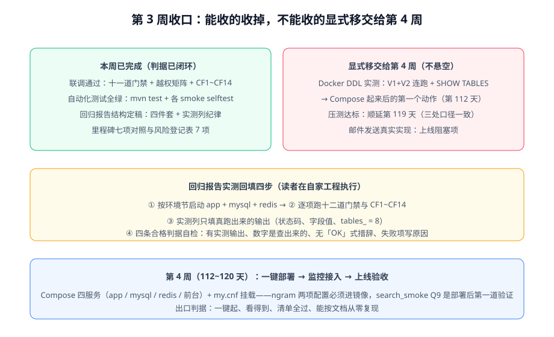

# 第 3 周收口：回归报告回填与第 4 周启动

:::info 本日为文档产出
本页是周期 4 第 3 周（第 105~111 天）的**正式收口页**：把[回归报告](../CoreFlow/Regression/index.md)的实测回填落成可执行清单、对两项悬空欠账做出显式处置决定，并正式启动第 4 周（部署 + 文档沉淀）。本日不新增门禁与代码口径——收口的含义就是**不再开新口子**。
:::



## 一、收口原则：能收的收掉，不能收的显式移交

第 3 周的里程碑是「联调 + 测试」。截至第 110 天，可收口的部分已经全部闭环（见[第 3 周验收结论](../CoreFlow/Acceptance/index.md)）：

| 里程碑项 | 状态 | 判据入口 |
| --- | --- | --- |
| 联调通过 | ✅ | 十二道门禁全绿 + 越权矩阵 18 格 + CF1~CF14 |
| 自动化测试全绿 | ✅ | `mvn test` + 各 smoke `--selftest` |
| 压测达标 | ⏳ 顺延 | 依赖第 4 周稳定部署形态，**顺延第 119 天**（轮换表 / Progress / 验收结论三处口径一致） |

第 111 天要做的是把**剩下没有闭环的部分逐一显式处置**——要么给出可执行路径，要么登记为带判据的移交项。**不允许出现「既没做完也没人认领」的悬空项**，这是收口区别于「不了了之」的唯一标志。

## 二、回归报告实测回填：可执行清单

[回归报告一章](../CoreFlow/Regression/index.md)已定稿结构与纪律（实测列只填真跑出来的输出）。本日把「怎么回填」收敛成四步，读者在**自己的工程**里执行：

```shell
# ① 按回归报告的环境节启动依赖（读者工程内，Compose 或本地均可）
docker compose up -d mysql redis        # 或本地 mysqld / redis-server
cd your-project/service
mvn spring-boot:run                     # 默认 profile=local

# ② 逐项跑门禁（十二道），把输出原样贴进报告的实测列
python skeleton_check.py    --base http://127.0.0.1:18080   # checks = 27  failed = 0
python api_smoke.py         --base http://127.0.0.1:18080   # cases  = 9   passed = 9
python admin_smoke.py       --base http://127.0.0.1:18080   # steps  = 37  passed = 37
python lifecycle_smoke.py   --base http://127.0.0.1:18080   # steps  = 24  passed = 24
python visibility_smoke.py  --base http://127.0.0.1:18080   # steps  = 22  passed = 22
python comment_smoke.py     --base http://127.0.0.1:18080   # steps  = 28  passed = 28
python search_smoke.py      --base http://127.0.0.1:18080   # steps  = 9   passed = 9（需 ngram 配置）
python account_smoke.py     --base http://127.0.0.1:18080   # steps  = 22  passed = 22（需先执行 V2 DDL）
python ssr_smoke.py         --base http://127.0.0.1:3000 --api http://127.0.0.1:18080  # steps = 10 passed = 10
python coreflow_smoke.py    --base http://127.0.0.1:18080   # steps  = 14  passed = 14
python assertion_audit.py                                    # 期望 PASS

# ③ DDL 欠账项（见第三节）：V1 + V2 连跑 + SHOW TABLES，输出进报告第二节
```

回填合格判据（四条，与回归报告一致）：实测列与期望列**同形**（状态码对状态码、数字对数字）；`tables_ = 8` 这类数字是**查出来的**不是抄的；没有「OK / 通过」这类不可比对的措辞；失败项写**原因与处置**而不是跳过。

## 三、两项欠账的显式处置

### 欠账 1：Docker DDL 实测（第 1 周遗留）

V1+V2 增量脚本的判据早在[第 110 天回归报告](../CoreFlow/Regression/index.md)定稿：连跑两条迁移、`SHOW TABLES` 期望 8 张表、`parity_check` PASS。本日按「实测列纪律」给出规范记录：

:::danger 实测记录（如实）
**未跑。原因**：文档侧没有读者工程的运行环境，且该验证依赖第 4 周的 Compose 部署形态才有意义（部署后的首验才是对「从零复现」的真实检验）。**处置**：保持 ⏳，作为**第 112 天 Compose 搭建完成后的第一个动作**执行；判据不变，输出回填到回归报告第二节。**不得因为「判据已定稿」就把该项标 ✅**——实测列的价值就是区分「写了」和「跑过」。
:::

### 欠账 2：压测达标（顺延登记）

压测在第 3 周没有做，原因是**没有稳定部署形态**——对未收口的形态压测，得到的是噪音。处置：顺延第 119 天（轮换表 119 行「当月项目：联调与压测」），与第 4 周部署验收合并成闭环；顺延理由与三处口径见[验收结论](../CoreFlow/Acceptance/index.md)。

## 四、第 4 周启动：交接三件事

第 4 周（第 112~120 天）里程碑：**部署 + 文档沉淀**。三件事与判据入口（完整版见[验收结论](../CoreFlow/Acceptance/index.md)第 4 节）：

1. **一键部署**：Compose 四服务（app / mysql / redis / 前台）+ `my.cnf` 挂载。**红线**：第 107 天的两项 ngram 配置必须进镜像——`search_smoke` Q9（中文词元搜索）是部署后的第一道验证，静默失效比报错更危险。
2. **监控接入**：CF14 已断言 `traceId` 可串链，第 4 周在其上补指标（QPS / P95 / 缓存命中率）与告警口径。
3. **上线验收清单**：从零复现是出口判据——只照文档走一遍就能跑起来，文档里没写的步骤都算 bug。

## 五、验证方式

本日收口的完成判据（全部可在文档侧核对）：

1. 全项目搜索「⏳」——每一处待办都能追溯到**归属周与判据入口**（Docker DDL → 第 112 天首验；压测 → 第 119 天；ES → 刻意不做已登记）。
2. 回归报告的四步回填清单中，**每条命令在总览页都有对应的期望值**，两处数字一致。
3. Progress 第 111 天段落与轮换表 111 行口径一致：本日产出 = 收口页 + 回填清单 + 欠账处置，不新增门禁。

## 参考资料

- [回归报告：结构与实测列纪律](../CoreFlow/Regression/index.md)
- [第 3 周验收结论与顺延项登记](../CoreFlow/Acceptance/index.md)
- [进展记录 · 第 111 天](../Progress/index.md)
