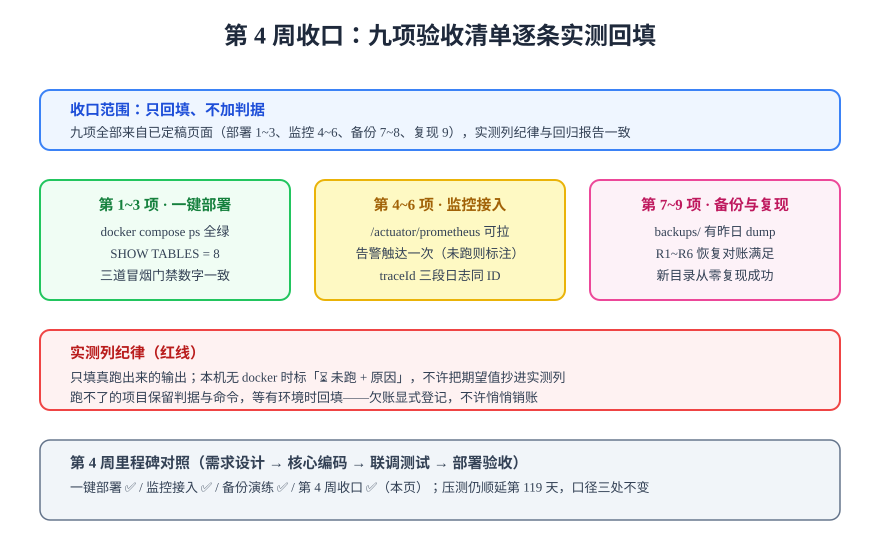

# 第 4 周收口：上线验收清单实测回填

:::info 本日为文档产出
本页是周期 4 第 4 周（第 112~115 天）的**正式收口页**：对照[上线验收清单](../BackupDrill/index.md)九项逐条回填实测状态、对第 4 周四项里程碑做对照定稿，并显式登记仍为 ⏳ 的项与它们的兑现路径。本日不新增判据、不新增门禁——收口的含义就是**不再开新口子**（与[第 3 周收口](../Week3Close/index.md)同一原则）。
:::

## 一、收口原则：只回填，不加判据

九项验收判据在[第 114 天](../BackupDrill/index.md)已合并定稿，出处分别是[一键部署](../Deployment/index.md)（1~3）、[监控接入](../Monitoring/index.md)（4~6）、[备份恢复演练](../BackupDrill/index.md)（7~8）与从零复现（9）。本日做的是**把它们逐条落到实测状态**，遵循与回归报告同一条纪律：**实测列只填真跑出来的输出；跑不了就标「⏳ 未跑 + 原因」，不许把期望值抄进实测列**。

## 二、九项验收清单逐条回填

| # | 验收项 | 判据 | 实测状态 | 说明 |
| --- | --- | --- | --- | --- |
| 1 | 五服务全部 Up / healthy | `docker compose ps` 全绿 | ⏳ 未跑 | 本机无 docker 环境，判据与命令已定稿 |
| 2 | DDL 实测 | 表数 = 8，ngram = 2 / OFF | ⏳ 未跑 | 同上；`SHOW TABLES` 与两条运行时变量已写入[一键部署](../Deployment/index.md)第六步 |
| 3 | 三条冒烟门禁通过 | search 9/9、skeleton 27/0、coreflow 14/14 | ⏳ 未跑 | 门禁脚本已定稿，待 Compose 环境执行 |
| 4 | 指标可拉取 | `/actuator/prometheus` 含 `http_server_requests` | ⏳ 未跑 | 同 1 |
| 5 | 告警链路实测触达一次 | 值班渠道收到通知 | ⏳ 未跑 | 阈值口径已定稿，触达属一次性人工验证 |
| 6 | traceId 三段日志闭环 | 任取请求 grep 三段日志同 ID | ⏳ 未跑 | 判据来自 CF14，验证命令见监控页 |
| 7 | 备份任务在跑 | `backups/` 有昨日 dump | ⏳ 未跑 | 策略与保留期已定稿 |
| 8 | 恢复演练通过 | R1~R6 全部满足 | ⏳ 未跑 | 四步演练流程与对账判据已定稿 |
| 9 | 从零复现 | 新目录按总览文档重建成功 | ⏳ 未跑 | 复现依赖 1~8 的环境，一并顺延 |

:::danger 为什么九项全部 ⏳ 而不是打 ✅
判据 ≠ 实测。本机没有 docker 环境，按实测列纪律**只能标 ⏳ 并写明原因**，把期望值抄进实测列等于伪造记录。九项的**判据、命令、期望输出**全部已定稿且可执行——这是「文档先行、实测后补」的显式欠账，不是静默销账。
:::

## 三、欠账的兑现路径

九项 ⏳ 收敛为**一个前置条件**：一台有 Docker 的机器。兑现动作收敛为一页清单（[一键部署](../Deployment/index.md)首次部署六步），执行完成后九项逐条回填：

1. `docker compose up -d` 五服务起齐，`docker compose ps` 全绿（覆盖 1）；
2. 跑 V1+V2 迁移与 `SHOW TABLES`、ngram 运行时核验（覆盖 2）；
3. 三条冒烟门禁 + 指标拉取 + traceId 走查（覆盖 3、4、6）；
4. 配置告警渠道后手动触发一次（覆盖 5）；
5. 观察次日 `backups/`，执行一次临时容器恢复演练（覆盖 7、8）；
6. 在新目录按[总览](../index.md)从零复现一遍（覆盖 9）。

预计半天内可完成全部回填；回填产物追加进[回归报告](../CoreFlow/Regression/index.md)的实测列与[进展记录](../Progress/index.md)。

## 四、第 4 周里程碑对照定稿

| 里程碑 | 页面 | 状态 | 说明 |
| --- | --- | --- | --- |
| 一键部署 | [Deployment](../Deployment/index.md) | ✅ 判据定稿 | 五服务 Compose + 首次 DDL 判据，实测随欠账一并回填 |
| 监控接入 | [Monitoring](../Monitoring/index.md) | ✅ 判据定稿 | 六项指标口径 + 告警阈值 + traceId 三判据 |
| 备份恢复演练 | [BackupDrill](../BackupDrill/index.md) | ✅ 判据定稿 | 恢复四步 + R1~R6 + 九项清单合并 |
| 第 4 周收口 | 本页 | ✅ | 九项回填 + 欠账显式登记 |

:::tip 与第 3 周收口的口径一致性
压测仍顺延**第 119 天**，归属口径三处不变：[第 3 周收口](../Week3Close/index.md)、[验收结论](../CoreFlow/Acceptance/index.md)、[项目总览](../index.md)。第 4 周收口不改变该口径，也不新增「复盘」性质的章节——收口页只做状态收敛与移交。
:::

## 当日做了什么 / 如何验证 / 下一步

- **做了什么**：上线验收清单九项逐条回填实测状态（判据定稿、实测 ⏳ 未跑 + 原因），欠账收敛为「Docker 环境上一页清单跑通」单一前置条件；第 4 周四项里程碑对照定稿。
- **如何验证**：本页为文档产出——验证方式是核对每行 ⏳ 均附原因、每项判据可回溯到出处页面；九项对应的全部命令在各自页面可复制执行。
- **下一步**：第 119 天做**压测**（口径与[第 3 周收口](../Week3Close/index.md)一致）；拿到 Docker 环境后按第三节六步完成九项实测回填。第 5 周起进入周期 4 的收尾与文档沉淀。
