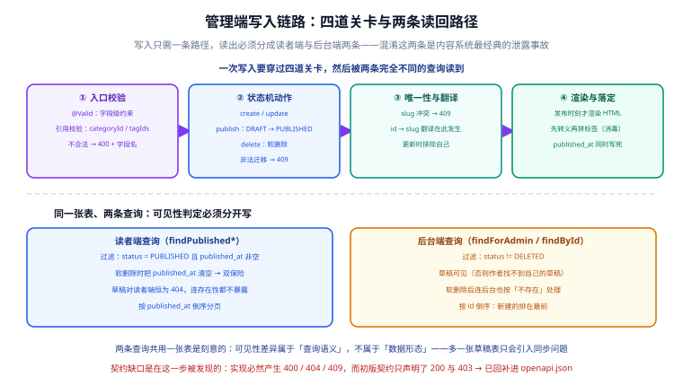

# 文章写入链路

第 98 天的构建步骤：把「写作 → 发布 → 被读者读到」这条**写链路**真正打通——管理端 CRUD、发布状态机、分类标签字典，以及配套的第三道门禁。这一天的产出不是「多加几个接口」，而是让**契约里声明的写分支（400/409/404）第一次有了实现**。



## 一句话定位

在此之前，项目只有读者端查询：数据靠内存种子，改不了、发不了。本日起，文章可以被**创建、编辑、发布、软删除**，且每一步的状态变化都由**显式动作**驱动，而不是靠前端传一个 `status` 字段。

## 当天的目标与判据

| 目标 | 判据（可本地验证） |
| --- | --- |
| 管理端能创建草稿 | `POST /api/v1/admin/posts` 返回 200，`status=DRAFT`、`publishedAt=null` |
| 草稿对读者端**完全不可见** | 列表 `total` 不变；按 slug 查详情返回 404（不是 200 + 空内容） |
| 发布是唯一的「转 PUBLISHED」入口 | `POST /{id}/publish` 成功；**重复发布返回 409**，不做假幂等 |
| 更新不重置状态与发布时间 | 对已发布文章 PUT 后，`status` 仍为 `PUBLISHED`、`publishedAt` 变化前后一致 |
| 更新必须重算渲染结果 | PUT 改 `contentMd` 后，读者端详情拿到的是**新 HTML** |
| 唯一键冲突统一 409 | slug / 分类 name / 标签 name 冲突均返回 `2002` |
| 参数与引用错误统一 400 且带字段名 | `message` 里能直接读到 `title` / `slug` / `categoryId` / `tagIds` |
| 正文不可注入脚本 | 渲染结果里 `<script>` 被转义；`javascript:` 链接不生成 `<a>` |
| 全部判据可重复执行 | `admin_smoke.py` 连跑两遍都 37/37（不重启服务） |

## 接口清单

| 方法 | 路径 | 成功 | 主要错误 |
| --- | --- | --- | --- |
| `POST` | `/api/v1/admin/posts` | 200 返回文章的 `PostSummary` | 400 参数/引用不合法；409 slug 冲突 |
| `PUT` | `/api/v1/admin/posts/{id}` | 200 返回更新后的摘要 | 400；404 不存在或已软删；409 slug 撞他人 |
| `DELETE` | `/api/v1/admin/posts/{id}` | 200，`data=null` | 404（**重复删除也 404**） |
| `POST` | `/api/v1/admin/posts/{id}/publish` | 200，`status=PUBLISHED` + `publishedAt` | 404；409 状态冲突（非 DRAFT） |
| `POST` | `/api/v1/admin/categories` | 200 返回 `CategoryView` | 400 slug 非法；409 name 或 slug 冲突 |
| `POST` | `/api/v1/admin/tags` | 200 返回 `TagView` | 400；409 |
| `GET` | `/api/v1/categories`、`/api/v1/tags` | 200 返回字典全量 | — |

:::tip 提示
契约里 `PostUpsert` **没有 `status` 字段**，这是刻意设计。把状态放进 upsert，前端随手传一个 `PUBLISHED` 就绕过了发布动作上的全部校验（发布时间、渲染产物）。**状态只能被动作改变**，这条纪律一旦松掉，后面所有状态机校验都形同虚设。
:::

## 状态机与软删除

```text
        创建              publish
  （无） ────▶ DRAFT ──────────────▶ PUBLISHED
                │                        │
                │ delete                 │ delete
                ▼                        ▼
             DELETED ◀───────────────────┘
```

三条实现纪律：

1. **`DELETED` 不在对外契约的枚举里**。契约只暴露 `DRAFT / PUBLISHED / OFFLINE`，`DELETED` 是内部终态——对外表现为「这个 id 不存在」。这样读者端与后台端都不需要理解「已删除」这个状态，只需按 404 处理。
2. **软删除会清空 `publishedAt`**。领域对象的可见性判据是 `published() = status == "PUBLISHED" && publishedAt != null`；清空发布时间让「有人绕过状态判断」也放不出已删文章，是一道冗余防线。
3. **两条查询各自过滤，各自表述**。读者端查 `Published`，后台端查「非 `DELETED`」。写成一个查询再加参数，必然会出现「少传一个参数就把草稿漏出去」的事故。

```java [PostRepository.java（节选）]
// 读者端：只可能返回已发布
Optional<Post> findPublishedBySlug(String slug);

// 后台端：过滤掉软删除，方法名把「给谁看」写进语义
Page<Post> findForAdmin(int page, int size);
```

## 三道校验分别守在哪一层

写接口的 4xx 分支最容易「看起来实现了、其实漏了」，所以每一层只负责一件事：

| 层 | 守什么 | 手段 | 漏掉的后果 |
| --- | --- | --- | --- |
| DTO | 形状与格式：非空、长度、`^[a-z0-9-]+$` | Bean Validation 注解 | 非法数据进入业务逻辑，靠 `if` 逐个补，必然漏 |
| Controller | 引用完整性：`categoryId` / `tagIds` 是否真实存在 | `taxonomy.findCategory/findTags` | 建出「分类为 null 的幽灵文章」，前台按分类查不到 |
| 数据层 | 唯一键：slug / name 是否已被占用 | `existsSlug` / `existsSlugExcept` | 要么静默覆盖，要么抛 500 |

唯一键判断有个隐蔽的坑：**更新时必须「排除自己」**。

```java [AdminPostController.java（节选）]
// 更新时若不自排，作者什么都没改、只是点了保存，也会撞上自己那条记录
if (posts.existsSlugExcept(req.slug(), id)) {
    throw new BizException(ErrorCode.RESOURCE_CONFLICT);
}
```

### 错误码 → HTTP 的映射只出现一次

```java [GlobalExceptionHandler.java（节选）]
HttpStatus status = switch (ex.errorCode()) {
    case PARAM_INVALID, PARAM_PAGE_OUT_OF_RANGE -> HttpStatus.BAD_REQUEST;
    case RESOURCE_NOT_FOUND -> HttpStatus.NOT_FOUND;
    case RESOURCE_CONFLICT, STATE_CONFLICT -> HttpStatus.CONFLICT;
    case UNAUTHORIZED -> HttpStatus.UNAUTHORIZED;
    case FORBIDDEN -> HttpStatus.FORBIDDEN;
    default -> HttpStatus.INTERNAL_SERVER_ERROR;
};
return ResponseEntity.status(status).body(Result.fail(ex.errorCode(), ex.detail()));
```

`detail` 是这一天新加的：**只回一句「参数不合法」，后台表单无法自修**。约定是 `code` 仍取错误码本身（客户端按 code 分支），`message` 变成「错误码文案：定位信息」（人看这一串）——两条信息各归其位。

```json
{ "code": 1001, "message": "参数不合法：categoryId 不存在：999999", "data": null }
```

:::danger 注意
两个必须避开的分支设计：

1. **不要用 HTTP 状态码承载业务错误码**（例如 2001 就返回 HTTP 2001）。网关、监控、客户端重试策略都依赖标准状态码工作，自造状态码会让它们全部失效。
2. **重复发布不要返回 200**。返回成功会造成「幂等」的假象，掩盖调用方手里已过期的事实——它永远发现不了自己该刷新状态。状态冲突就是要 409。
:::

## Markdown 渲染管线

正文存**原文**（`contentMd`），发布时才渲染出 `contentHtml`。渲染器的安全关键不在能力，而在**顺序**：

```java [MarkdownRenderer.java（节选）]
/** 行内语法：输入已被调用方 escape，产出的标签是唯一允许出现的标签。 */
private static String inline(String text) {
    String s = escape(text);                       // ① 先全量转义
    s = s.replaceAll("\\*\\*(.+?)\\*\\*", "<strong>$1</strong>");   // ② 再拼自己产出的标签
    s = s.replaceAll("`([^`]+)`", "<code>$1</code>");
    s = s.replaceAll("\\[([^\\]]+)\\]\\((https?://[^)\\s]+|/[^)\\s]*)\\)", "<a href=\"$2\">$1</a>");
    s = s.replaceAll("\\[([^\\]]+)\\]\\(([^)]*)\\)", "$1（$2）");   // 非法协议整段降级为纯文本
    return s;
}
```

| 明确支持 | 明确不支持（按纯文本输出，不做「看起来像但不安全」的降级） |
| --- | --- |
| `#`~`###` 标题、段落、无序列表、围栏代码块 | 表格、引用块、嵌套列表、HTML 混排 |
| 行内 `**粗体**`、反引号代码 | — |
| 链接：仅 `http/https` 与站内 `/` 路径 | `javascript:`、`data:` 等一切其他协议 |

:::warning 说明
为什么自己写而不是引一个 Markdown 库：引库意味着把它的**全部攻击面与升级负担**一起引进来，而本项目只需要「后台作者写的 Markdown → 读者端安全 HTML」这一条路径。顺序对了，就不存在「消毒漏项」——所有用户输入都先变成文本。
:::

## 一次性装配点：`LocalRepositoryConfig`

数据层刻意**不加 Spring 注解**（保持框架无关），所以「用哪个实现」只在装配层出现：

```java [LocalRepositoryConfig.java]
@Configuration
@Profile("local")
public class LocalRepositoryConfig {

    @Bean
    public TaxonomyRepository taxonomyRepository() {
        return new InMemoryTaxonomyRepository();
    }

    @Bean
    public PostRepository postRepository(TaxonomyRepository taxonomyRepository) {
        return new InMemoryPostRepository(taxonomyRepository);
    }
}
```

依赖用**构造参数**表达而不是 `@DependsOn`：编译期就能发现循环依赖，可读性也更好。后续接真库只改这一个类，上层一行不动。

分类/标签的 **id → slug 翻译只发生在这里一处**：写入方（后台下拉框）拿到的是 id，读者端与 SEO 要的是 slug。契约「写入用 id、读出用 slug」是刻意的——id 是内部主键，不该出现在 URL 里。

## 实战：用 curl 走完整条链路

```shell
# ① 起服务（local profile：内存仓储，无需数据库）
cd project/Complete/BlogPlatform/service/blog-application
SERVER_PORT=18080 mvn -o spring-boot:run
```

另开终端：

```shell
B=http://127.0.0.1:18080

# ② 创建草稿 —— 注意入参里没有 status
curl -s -X POST $B/api/v1/admin/posts \
  -H 'Content-Type: application/json' \
  -d '{"title":"第一篇","slug":"first-post","categoryId":1,"tagIds":[11],"contentMd":"# 标题\n\n正文 **加粗**。"}'
# → {"code":0,"message":"成功","data":{"id":9101,"slug":"first-post","status":"DRAFT","publishedAt":null,...}}

# ③ 草稿不可读（读者端按 slug 查一律 404，不暴露存在性）
curl -s -o /dev/null -w '%{http_code}\n' $B/api/v1/posts/first-post     # → 404

# ④ 重复发布前先发布一次
curl -s -X POST $B/api/v1/admin/posts/9101/publish
# → data.status = "PUBLISHED"，data.publishedAt 有值

# ⑤ 再发一次必须 409（状态冲突，不做假幂等）
curl -s -X POST $B/api/v1/admin/posts/9101/publish -w '\n%{http_code}\n'
# → {"code":2003,...} / 409

# ⑥ 读者端现在能读到渲染后的 HTML
curl -s $B/api/v1/posts/first-post
# → data.contentHtml 含 "<h1>标题</h1>" 与 "<strong>加粗</strong>"，且不含 contentMd

# ⑦ 更新已发布文章：状态与发布时间不变，但正文必须重算
curl -s -X PUT $B/api/v1/admin/posts/9101 \
  -H 'Content-Type: application/json' \
  -d '{"title":"第一篇（改）","slug":"first-post","categoryId":1,"contentMd":"## 第二版"}'
curl -s $B/api/v1/posts/first-post | grep -o '<h2>第二版</h2>'   # → 命中，说明重算生效

# ⑧ 软删除：随后读者端 404，重复删除同样 404
curl -s -X DELETE $B/api/v1/admin/posts/9101
curl -s -o /dev/null -w '%{http_code}\n' $B/api/v1/posts/first-post   # → 404
```

## 第三道门禁：`admin_smoke.py`

`skeleton_check.py` 管**结构**、`api_smoke.py` 管**只读行为**，这一天补上**写链路行为**：

```shell
cd project/Complete/BlogPlatform/service
python api_smoke.py   --base http://127.0.0.1:18080   # ✅ 实测：cases = 9  passed = 9
python admin_smoke.py --base http://127.0.0.1:18080   # ✅ 实测：steps = 37  passed = 37
python admin_smoke.py --selftest                      # ✅ 实测：selftest: 37/37 通过
```

### 为什么与 `api_smoke.py` 分开

| 脚本 | 数据影响 | 心智模型 | 能指向哪 |
| --- | --- | --- | --- |
| `api_smoke.py` | **只读** | 用例互不影响，一张表表达 | 任意环境（可指向预发） |
| `admin_smoke.py` | **会写数据** | 有状态顺序链路，后一步依赖前一步的产物 | 只能本地/一次性环境 |

把它们合成一个文件、用 `--readonly` 开关区分，等于把「安全边界」交给人的记忆。分开则是**结构性**的：只读脚本可以放心指向任何环境，因为它根本没有写的能力。

### 两个设计要点

**① 断言必须有牙齿。** `--selftest` 把响应体换成 `{}`、把上下文换成 `{}`，然后要求**每一步至少有一条断言报错**。如果某步在「什么都没有」的情况下依然全绿，它就是假门禁。这条自测当天真的抓到了一个：

```text
FAIL  捕获到的 id 是有效正数  （对空响应仍通过 1/1 条）
```

那一步只检查从上下文里读到的 id，与 HTTP 响应毫无关系——它永远不可能失败。修法是把它替换成对响应本身的断言：`field_gt("id", 9000)`（用「> 下界」而不是「存在」，因为 `null` 和 `0` 都能骗过存在性判断）。

**② 断言总数必须相对基线。** 最初的写法是把 `total=3`、`list_len(3)` 写死，结果是**脚本只能跑一遍**：第一遍创建的分类留在内存里，第二遍 `list_len(3)` 必然误报。改成「开跑先抓基线，之后断言 `基线+delta`」后，连跑两遍都是 37/37。

:::danger 注意
写完门禁必须**真的连跑两遍**。这一天第一版就是靠「跑第二遍」暴露的：`RUN_TAG` 只精确到秒，同一秒内两遍会撞 slug，于是「创建」拿到 409、后面 19 步级联失败——**报错指向接口，真因是测试数据撞名**。这类假失败最耗时间，所以在生成 slug 时就带上随机位（`uuid.uuid4().hex[:4]`）。
:::

## 当天修掉的两个真问题

| 问题 | 症状 | 根因与修法 |
| --- | --- | --- |
| 已发布文章改了正文，读者端仍显示旧内容 | 更新返回 200、状态与发布时间都对，但详情 HTML 是上一版 | `update` 沿用了旧的 `contentHtml`。它是 `contentMd` 的**派生物**，必须在 `status == PUBLISHED` 时重算；草稿则保持 `null`（发布时才渲染） |
| `BizException` 无法携带定位信息 | 编译报错：`需要 ErrorCode / 找到 ErrorCode,String` | 异常类补 `(ErrorCode, String detail)` 构造器，并把 `detail` 一路带到统一响应里 |

## 如何验证（当日收尾判据）

```shell
cd project/Complete/BlogPlatform/service

# ① 编译四模块（必须先 install，让 blog-data/blog-web 的新代码进本地仓库）
mvn -o install -DskipTests                    # ✅ 实测：BUILD SUCCESS，四模块全绿

# ② 起服务
cd blog-application && SERVER_PORT=18080 mvn -o spring-boot:run

# ③ 另开终端跑三道门禁
cd .. && python skeleton_check.py             # ✅ 实测：checks = 27  failed = 0
python api_smoke.py   --base http://127.0.0.1:18080   # ✅ 实测：cases = 9  passed = 9
python admin_smoke.py --base http://127.0.0.1:18080   # ✅ 实测：steps = 37  passed = 37
python admin_smoke.py --base http://127.0.0.1:18080   # ✅ 连跑第二遍仍 37/37（可重复）
python admin_smoke.py --selftest              # ✅ 实测：selftest: 37/37 通过
```

:::warning 说明
`mvn spring-boot:run` 在 `blog-application` 目录下执行时，只编译该模块，其余模块从本地仓库取。所以**改过 `blog-data`/`blog-web` 之后必须先回到 `service/` 跑一次 `mvn install`**，否则跑的是旧 jar——这一天在这上面真实浪费了一轮排查。反过来，服务在运行时会锁住本地仓库里的 jar，导致 `install` 报 `...tmp -> ....jar` 失败，**顺序必须是「先停服务、再安装、后启动」**。
:::

## 下一步

1. **仓储换真库**：`blog-data` 增加 JDBC 实现 + `-Pflyway` 装载 `db/mysql/V1__blog_init.sql`，验证真能建出 7 张表；`LocalRepositoryConfig` 旁边加 `JdbcRepositoryConfig`，上层不改。
2. **契约断言进 `mvn test`**：把 `admin_smoke.py` 的写链路步骤上移成 MockMvc 集成测试，让 CI 不需要起进程就能守住状态机。
3. **补认证与角色**：契约里声明的 401 / 403 分支目前尚未实现，这是第 2 周后续步骤。
4. **`POST /{id}/offline`**：与发布对称的下线动作，补齐 `PUBLISHED → OFFLINE` 这条边。

## 参考资料

- 接口契约与门禁：[接口契约](../Contract/index.md)
- 工程骨架与结构门禁：[工程骨架与验收门禁](../Skeleton/index.md)
- 逐日进展：[进展记录](../Progress/index.md)
- 验收条件写法：[完整项目交付](../../../../docs/Others/ProjectDelivery/index.md)
