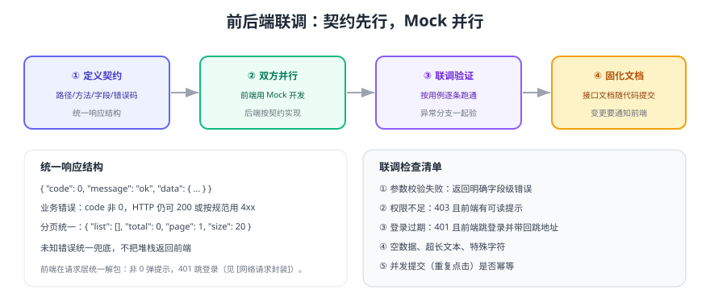

# 接口联调

前后端联调之所以经常"耗掉一半工期"，根因是**契约不明确 + 双方串行等待**。本页给出契约先行的做法、统一响应结构与联调清单。



## 一、统一响应结构

```json [成功响应]
{ "code": 0, "message": "ok", "data": { "id": 1001, "title": "修登录页样式" } }
```

```json [分页响应]
{ "code": 0, "message": "ok", "data": { "list": [], "total": 0, "page": 1, "size": 20 } }
```

```json [业务错误]
{ "code": 40001, "message": "任务不存在", "data": null }
```

| 约定 | 说明 |
| --- | --- |
| `code=0` 表示成功 | 前端统一在请求层判断，非 0 直接提示并抛错 |
| HTTP 状态码 | 401 未登录、403 无权限、404 不存在、5xx 服务异常 |
| 字段命名 | 统一 `camelCase`，后端用 Jackson 配置转换 |
| 时间格式 | 统一 `yyyy-MM-dd HH:mm:ss`（或 ISO8601），前后端只选一种 |
| 空值 | 集合返回 `[]` 而不是 `null`，避免前端到处判空 |

::: danger 契约中最容易扯皮的四件事
1. **空值语义**：字段为空是 `null` 还是空字符串？提前约定，否则前端判断逻辑各写一套。
2. **时间与时区**：后端返回 UTC 还是本地时间？统一后写进文档。
3. **枚举取值范围**：状态值必须列全，前端才能做映射与校验。
4. **分页参数命名**：`page/size` 还是 `pageNum/pageSize`？全项目统一，避免每个接口不一样。
:::

## 二、核心接口清单

| 方法 | 路径 | 说明 | 权限 |
| --- | --- | --- | --- |
| POST | `/api/auth/login` | 登录，返回 token 与用户信息 | 匿名 |
| POST | `/api/auth/logout` | 登出（清理刷新令牌） | 登录 |
| GET | `/api/projects` | 项目分页列表 | 登录 |
| POST | `/api/projects` | 创建项目 | 登录 |
| PUT | `/api/projects/{id}` | 修改项目 | 负责人/管理员 |
| POST | `/api/projects/{id}/members` | 邀请成员并指定角色 | 负责人 |
| GET | `/api/projects/{id}/tasks` | 任务看板数据（按状态分组） | 项目成员 |
| POST | `/api/tasks` | 创建任务 | 项目成员 |
| PATCH | `/api/tasks/{id}/status` | 变更任务状态与排序 | 项目成员 |
| GET | `/api/logs` | 操作日志查询 | 管理员 |

## 三、契约文件与 Mock

契约建议用 OpenAPI（YAML）维护，并与代码同仓库：

```yaml [openapi.yaml（节选）]
paths:
  /api/tasks/{id}/status:
    patch:
      summary: 变更任务状态
      parameters:
        - name: id
          in: path
          required: true
          schema: { type: integer }
      requestBody:
        required: true
        content:
          application/json:
            schema:
              type: object
              required: [status, sort]
              properties:
                status: { type: string, enum: [TODO, DOING, DONE] }
                sort: { type: integer, minimum: 0 }
      responses:
        '200': { description: 成功 }
        '403': { description: 非项目成员 }
        '404': { description: 任务不存在 }
```

前端在后端未完成时用 Mock 并行开发（详见 [接口调试工具](../../../../docs/Tools/APITools/index.md) 的 Mock 章节）：

```ts [前端 Mock 约定]
// 只 mock 未完成的接口，已联调完成的走真实后端
export const USE_MOCK = import.meta.env.DEV && import.meta.env.VITE_USE_MOCK === 'true'
```

## 四、联调清单（每条都要跑）

| 场景 | 期望 |
| --- | --- |
| 参数校验失败 | 返回字段级错误信息，前端定位到具体输入框 |
| 未登录访问 | 401，前端跳登录并携带 `redirect` |
| 越权访问 | 403，前端提示"无权限"而不是白屏 |
| 资源不存在 | 404，前端展示空状态 |
| 重复提交 | 幂等（同一请求返回同一结果）或前端按钮防重 |
| 大数据量 | 分页参数生效，接口耗时在可接受范围 |
| 特殊字符 | 中文、emoji、单引号、超长文本不报错 |

::: tip 联调效率的三个习惯
1. **一次只测一条链路**，跑通再换下一条，避免"到处改、到处错"。
2. **保留请求记录**：用 [接口调试工具](../../../../docs/Tools/APITools/index.md) 保存集合，问题可复现。
3. **改契约必同步**：接口字段一改，立刻更新 OpenAPI 并通知前端，避免"线上才知道"。
:::

## 验证方式

1. 用 `curl` 或 API 工具按接口清单逐条调用，确认响应结构与本文档一致。
2. 逐条执行联调清单中的 7 个场景，记录实际结果与偏差。
3. 让前端在 `USE_MOCK=false` 下跑通主流程，确认无需改动页面代码。
4. 用 OpenAPI 文件生成文档，确认与实际返回一致（字段名、枚举、必填）。

## 参考资料

- OpenAPI 规范：https://spec.openapis.org/oas/latest.html
- 本库接口调试：[接口调试工具](../../../../docs/Tools/APITools/index.md)
