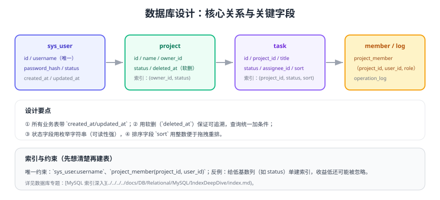

# 数据库设计

数据库设计决定了后续编码与性能的上限。本页给出**先画关系、再定字段、最后定索引**的顺序，以及示例项目可直接执行的建表 SQL。



## 一、先定关系，再定字段

| 实体 | 关系 | 说明 |
| --- | --- | --- |
| 用户 sys_user | 1 : N 项目（owner） | 一个人可以拥有多个项目 |
| 项目 project | N : N 用户（成员） | 通过 project_member 关联，并带角色 |
| 项目 project | 1 : N 任务 task | 任务属于某个项目 |
| 用户 sys_user | 1 : N 任务（assignee） | 任务指派给某个成员 |
| 操作日志 operation_log | N : 1 用户 | 谁做了什么 |

::: tip 设计顺序
**关系 → 字段 → 约束 → 索引 → 迁移脚本**。先想清楚关系，能避免"字段加完才发现少了中间表"的返工。
:::

## 二、建表 SQL

```sql [V1__init.sql]
-- 用户
CREATE TABLE sys_user (
  id            BIGINT       NOT NULL AUTO_INCREMENT,
  username      VARCHAR(64)  NOT NULL COMMENT '登录名',
  password_hash VARCHAR(100) NOT NULL COMMENT 'bcrypt 哈希',
  nickname      VARCHAR(64)  NOT NULL DEFAULT '',
  status        VARCHAR(16)  NOT NULL DEFAULT 'ACTIVE' COMMENT 'ACTIVE/DISABLED',
  created_at    DATETIME     NOT NULL DEFAULT CURRENT_TIMESTAMP,
  updated_at    DATETIME     NOT NULL DEFAULT CURRENT_TIMESTAMP ON UPDATE CURRENT_TIMESTAMP,
  PRIMARY KEY (id),
  UNIQUE KEY uk_username (username)
) ENGINE=InnoDB DEFAULT CHARSET=utf8mb4 COMMENT='用户';

-- 项目
CREATE TABLE project (
  id         BIGINT      NOT NULL AUTO_INCREMENT,
  name       VARCHAR(128) NOT NULL,
  owner_id   BIGINT      NOT NULL,
  status     VARCHAR(16)  NOT NULL DEFAULT 'ACTIVE' COMMENT 'ACTIVE/ARCHIVED',
  deleted_at DATETIME     NULL COMMENT '软删时间',
  created_at DATETIME     NOT NULL DEFAULT CURRENT_TIMESTAMP,
  updated_at DATETIME     NOT NULL DEFAULT CURRENT_TIMESTAMP ON UPDATE CURRENT_TIMESTAMP,
  PRIMARY KEY (id),
  KEY idx_owner_status (owner_id, status)
) ENGINE=InnoDB DEFAULT CHARSET=utf8mb4 COMMENT='项目';

-- 项目成员（含角色）
CREATE TABLE project_member (
  id         BIGINT      NOT NULL AUTO_INCREMENT,
  project_id BIGINT      NOT NULL,
  user_id    BIGINT      NOT NULL,
  role       VARCHAR(16)  NOT NULL DEFAULT 'MEMBER' COMMENT 'OWNER/ADMIN/MEMBER',
  created_at DATETIME     NOT NULL DEFAULT CURRENT_TIMESTAMP,
  PRIMARY KEY (id),
  UNIQUE KEY uk_project_user (project_id, user_id),
  KEY idx_user (user_id)
) ENGINE=InnoDB DEFAULT CHARSET=utf8mb4 COMMENT='项目成员';

-- 任务
CREATE TABLE task (
  id          BIGINT       NOT NULL AUTO_INCREMENT,
  project_id  BIGINT       NOT NULL,
  title       VARCHAR(200) NOT NULL,
  description TEXT         NULL,
  status      VARCHAR(16)  NOT NULL DEFAULT 'TODO' COMMENT 'TODO/DOING/DONE',
  assignee_id BIGINT       NULL,
  sort        INT          NOT NULL DEFAULT 0 COMMENT '同列内排序',
  deleted_at  DATETIME     NULL,
  created_at  DATETIME     NOT NULL DEFAULT CURRENT_TIMESTAMP,
  updated_at  DATETIME     NOT NULL DEFAULT CURRENT_TIMESTAMP ON UPDATE CURRENT_TIMESTAMP,
  PRIMARY KEY (id),
  KEY idx_project_status_sort (project_id, status, sort),
  KEY idx_assignee (assignee_id)
) ENGINE=InnoDB DEFAULT CHARSET=utf8mb4 COMMENT='任务';

-- 操作日志
CREATE TABLE operation_log (
  id          BIGINT       NOT NULL AUTO_INCREMENT,
  user_id     BIGINT       NOT NULL,
  target_type VARCHAR(32)  NOT NULL COMMENT 'PROJECT/TASK/MEMBER',
  target_id   BIGINT       NOT NULL,
  action      VARCHAR(32)  NOT NULL COMMENT 'CREATE/UPDATE/STATUS_CHANGE/DELETE',
  detail      JSON         NULL COMMENT '变更前后内容摘要',
  created_at  DATETIME     NOT NULL DEFAULT CURRENT_TIMESTAMP,
  PRIMARY KEY (id),
  KEY idx_target (target_type, target_id, created_at),
  KEY idx_user_time (user_id, created_at)
) ENGINE=InnoDB DEFAULT CHARSET=utf8mb4 COMMENT='操作日志';
```

## 三、约束与索引要点

| 决策 | 做法 | 原因 |
| --- | --- | --- |
| 唯一约束 | `username`、(project_id, user_id) 唯一 | 从数据库层杜绝重复数据 |
| 软删 | `deleted_at`，查询统一加 `deleted_at IS NULL` | 可追溯、可恢复；注意"软删 + 唯一索引"冲突 |
| 组合索引 | `(project_id, status, sort)` | 覆盖看板查询的 WHERE + ORDER BY |
| 日志表 | 只追加不修改，按时间索引 | 便于按时间范围追溯 |
| 字段类型 | 金额用 `DECIMAL`，时间用 `DATETIME` | 避免浮点误差与时区歧义 |

```sql [看板查询（验证索引是否命中）]
EXPLAIN SELECT id, title, status, sort
FROM task
WHERE project_id = 1001 AND deleted_at IS NULL
ORDER BY status, sort;
-- 期望：type=ref，key=idx_project_status_sort，Extra 不含 Using filesort
```

::: danger 三个容易返工的设计问题
1. **唯一索引与软删冲突**：删除后重建同名记录会撞唯一键；解决办法是把 `deleted_at` 纳入唯一键或用"删除标记位 + 时间戳"。
2. **状态用数字**：`status=1/2/3` 可读性差、维护困难；除非有性能硬需求，否则用字符串枚举。
3. **不写迁移脚本只改表**：环境之间结构不一致，上线时才发现缺字段。每次变更都要有版本化脚本（如 Flyway/Liquibase 命名的 `V{n}__xxx.sql`）。
:::

## 四、迁移与初始化数据

```shell
# 用 Docker 起一个本地 MySQL 8.4 验证脚本可执行
docker run -d --name mysql-dev -e MYSQL_ROOT_PASSWORD=root -e MYSQL_DATABASE=taskhub \
  -p 3306:3306 mysql:8.4

# 执行迁移脚本（示例）
docker exec -i mysql-dev mysql -uroot -proot taskhub < V1__init.sql

# 验证表结构
docker exec -i mysql-dev mysql -uroot -proot taskhub -e "SHOW TABLES; SHOW INDEX FROM task;"
```

预期结果：5 张表全部创建成功，`task` 表的 `idx_project_status_sort` 索引存在。

## 验证方式

1. 在干净数据库上执行 `V1__init.sql`，确认无报错。
2. 执行上面的 `EXPLAIN`，确认命中预期的组合索引且无 `Using filesort`。
3. 插入两条相同 `username` 与相同 `(project_id, user_id)`，确认唯一约束生效。
4. 插入 1 万条任务后重跑看板查询，确认响应时间在可接受范围（记录基线）。

## 参考资料

- 本库 MySQL 专题：[MySQL 概述](../../../../docs/DB/Relational/MySQL/Overview/index.md)、[索引深入](../../../../docs/DB/Relational/MySQL/IndexDeepDive/index.md)
- 数据库迁移工具：https://documentation.red-gate.com/flyway
