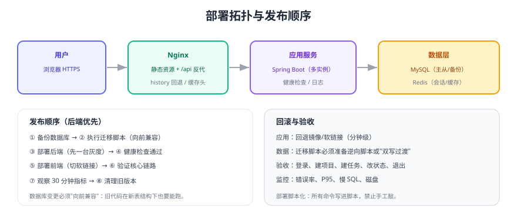

# 部署

部署的目标是**可重复、可验证、可回滚**。本页给出示例项目的部署拓扑、发布顺序、脚本与验收方式，容器化细节见 [Docker 专题](../../../../docs/Ops/Docker/index.md)，K8s 场景见 [完整项目](../index.md) 中的「全流程部署实战」（规划中）。



## 一、部署拓扑

| 组件 | 作用 | 关键配置 |
| --- | --- | --- |
| Nginx | 托管前端静态资源、反向代理 `/api` | `try_files` 回退、缓存头、HTTPS |
| 应用服务 | Spring Boot（可多实例） | 环境变量注入数据库/Redis 地址 |
| MySQL | 业务数据 | 主从或定期备份、慢查询日志 |
| Redis | 会话/缓存/限流 | 设置最大内存与淘汰策略 |

## 二、本地一键环境（Docker Compose）

```yaml [docker-compose.yml]
services:
  mysql:
    image: mysql:8.4
    environment:
      MYSQL_ROOT_PASSWORD: root
      MYSQL_DATABASE: taskhub
    ports: ["3306:3306"]
    volumes: ["mysql-data:/var/lib/mysql"]

  redis:
    image: redis:7
    ports: ["6379:6379"]

  backend:
    build: ./backend
    environment:
      SPRING_DATASOURCE_URL: jdbc:mysql://mysql:3306/taskhub?useSSL=false
      SPRING_DATASOURCE_USERNAME: root
      SPRING_DATASOURCE_PASSWORD: root
      SPRING_DATA_REDIS_HOST: redis
    ports: ["8080:8080"]
    depends_on: [mysql, redis]

volumes:
  mysql-data:
```

```shell
docker compose up -d
docker compose ps          # 三个服务应为 running/healthy
curl -s http://localhost:8080/actuator/health | jq '.status'   # 期望 UP
```

## 三、生产发布脚本（可复用）

```shell
#!/usr/bin/env bash
set -euo pipefail

APP_DIR=/data/www/taskhub
VERSION=$1                       # 例如 v1.2.0

echo "1) 备份数据库（发布前必做）"
mysqldump -h127.0.0.1 -uroot -p"$DB_PASSWORD" taskhub | gzip > "/data/backup/taskhub-$(date +%F-%H%M).sql.gz"

echo "2) 执行数据库迁移（保证向前兼容）"
mysql -h127.0.0.1 -uroot -p"$DB_PASSWORD" taskhub < "migrations/${VERSION}.sql"

echo "3) 部署后端（先启动新实例，再切流量）"
cd /opt/taskhub/backend && ./start.sh "$VERSION"
for i in {1..30}; do
  curl -sf http://127.0.0.1:8080/actuator/health >/dev/null && break
  sleep 2
done

echo "4) 部署前端（软链接原子切换）"
rsync -a --delete "dist-${VERSION}/" "${APP_DIR}/${VERSION}/"
ln -sfn "${APP_DIR}/${VERSION}" "${APP_DIR}/current"

echo "5) 验收"
curl -sf -o /dev/null -w "%{http_code}\n" https://app.example.com/            # 期望 200
curl -sf -o /dev/null -w "%{http_code}\n" https://app.example.com/api/health  # 期望 200
echo "发布完成：${VERSION}"
```

::: danger 发布阶段的五条铁律
1. **先备份再迁移**：没有备份的发布等于赌博。
2. **迁移必须向前兼容**：新表结构下旧代码仍能运行，否则回滚会失败。
3. **先部署后端再部署前端**：反之前端会调用不存在的接口。
4. **脚本化所有步骤**：手工敲命令必然漏步骤，尤其是深夜发布。
5. **保留上一个版本**：回滚要能在 1 分钟内完成。
:::

## 四、回滚预案

| 层面 | 回滚方式 | 预计耗时 |
| --- | --- | --- |
| 前端 | 软链接切回上一版本目录 | < 1 分钟 |
| 后端 | 切回上一镜像/版本目录并重启 | 1~3 分钟 |
| 数据库 | 执行逆向脚本或用备份恢复（**需评估数据丢失**） | 视数据量 |
| 配置 | 回滚配置中心版本 | < 1 分钟 |

演练要求：**每次发布前演练一次回滚**（至少前端与后端），记录实际耗时，超过预期的要优化脚本。

## 验证方式

1. 用 Docker Compose 在干净机器拉起全栈，确认健康检查返回 `UP`。
2. 按脚本执行一次完整发布（可在预发环境），记录每步耗时。
3. 执行一次前端与后端回滚，确认 3 分钟内恢复。
4. 部署后走查核心链路：登录 → 建项目 → 建任务 → 改状态 → 退出。
5. 检查数据库慢查询日志与磁盘占用，确认无异常增长。

## 参考资料

- Docker Compose 官方文档：https://docs.docker.com/compose/
- Nginx 官方文档：https://nginx.org/en/docs/
- 本库运维专题：[Docker](../../../../docs/Ops/Docker/index.md)、[监控告警](../../../../docs/Ops/Monitoring/index.md)
