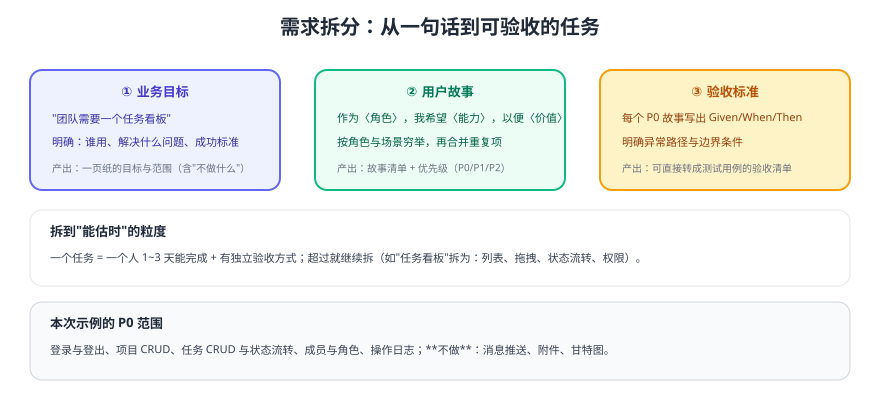

# 需求拆分

需求阶段的目标不是写一堆文档，而是把"要做的事"拆到**能估时、能验收、能追踪**的粒度。本页给出可复用的拆解方法与本次示例项目的完整产出。



## 一、先写一页纸：目标与边界

| 项 | 内容 |
| --- | --- |
| 业务目标 | 团队能在系统内管理项目与任务，替代"群里喊 + 表格记" |
| 使用角色 | 管理员（管人与全局）、项目负责人（管项目）、成员（管自己的任务） |
| 成功标准 | 任务状态流转在系统内完成，且有操作日志可追溯 |
| 不做什么 | 附件、消息推送、甘特图、复杂报表 |
| 约束 | 内网部署、数据不出内网、单人维护 |

## 二、用户故事（按角色穷举）

| ID | 角色 | 故事 | 优先级 |
| --- | --- | --- | --- |
| US-01 | 成员 | 作为成员，我希望用账号密码登录，以便访问自己的工作台 | P0 |
| US-02 | 负责人 | 作为负责人，我希望创建/编辑项目，以便组织团队工作 | P0 |
| US-03 | 负责人 | 作为负责人，我希望邀请成员并分配角色，以便控制权限 | P0 |
| US-04 | 成员 | 作为成员，我希望创建任务并指派给他人，以便分派工作 | P0 |
| US-05 | 成员 | 作为成员，我希望拖动任务改变状态，以便直观看到进度 | P0 |
| US-06 | 管理员 | 作为管理员，我希望查看操作日志，以便追溯变更 | P0 |
| US-07 | 成员 | 作为成员，我希望收到任务变更通知 | P1（本迭代不做） |

::: danger 用户故事最常见的三个错误
1. **以"功能"代替"故事"**："做一个拖拽组件"不是故事，用户视角应该是"我希望拖动任务改变状态"。
2. **没有优先级**：所有需求都是 P0 等于没有优先级，必须先定 P0 范围。
3. **缺少异常路径**：只写"成功时怎样"，不写"失败/无权限/超时时怎样"，联调时必然返工。
:::

## 三、验收标准（Given / When / Then）

```text
US-05 拖动任务改变状态
Given：我是本项目成员，且任务当前状态为「待办」
When：我把任务拖到「进行中」列
Then：
  1) 界面立即更新（乐观更新），失败时回滚并提示
  2) 服务端持久化成功，刷新页面后状态仍为「进行中」
  3) 操作日志新增一条记录：任务 ID、原状态、新状态、操作人、时间
  4) 非项目成员无法执行该操作（接口返回 403）
```

验收标准要**直接能翻译成测试用例**：上面的四条就是 1 条 E2E + 1 条接口测试 + 1 条单元测试。

## 四、任务拆分与估时

| 任务 | 拆分依据 | 估时 |
| --- | --- | --- |
| 登录与鉴权 | 前端页面 + 接口 + token 存储 | 1 天 |
| 项目 CRUD | 列表/详情/表单 + 接口 + 权限 | 2 天 |
| 任务看板 | 列表 + 拖拽 + 状态流转 + 排序 | 3 天 |
| 成员与角色 | 邀请、列表、角色变更 | 1.5 天 |
| 操作日志 | 记录 + 查询列表 | 1 天 |
| 测试与部署 | 用例 + 脚本 + 文档 | 1.5 天 |

::: tip 拆到"能估时"的三个判据
1. 一个人能在 **1~3 天**内完成；
2. 有**独立的验收方式**（能单独测、单独上线）；
3. 完成后**不阻塞其他任务**（否则说明拆分切错了依赖）。
:::

## 验证方式

1. 把本文档交给一位没参与讨论的同事，请其复述"要做什么、不做什么、怎么算完成"；复述偏差>20% 说明需求没写清。
2. 抽查 3 条验收标准，确认可以直接写成测试用例（含异常路径）。
3. 用任务表核对总工时与迭代周期是否匹配；超出则砍 P1。

## 参考资料

- 用户故事与验收标准：https://www.agilealliance.org/glossary/user-story-template/
- 本库项目管理工具：[协作与项目管理](../../../../docs/Tools/Others/index.md)
