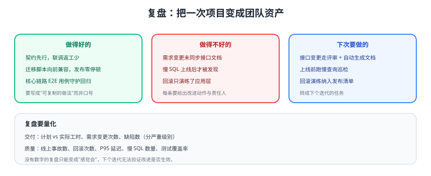

# 复盘

复盘的目的是**把一次项目变成团队可复用的资产**。本页给出复盘模板、示例项目的量化指标，以及如何把结论转成下一迭代的任务。



## 一、先量化，再讨论

| 维度 | 指标 | 示例值 | 说明 |
| --- | --- | --- | --- |
| 交付 | 计划 vs 实际工时 | 10 天 vs 12.5 天 | 偏差要归因到具体任务 |
| 交付 | 需求变更次数 | 3 次 | 变更来源与影响范围 |
| 质量 | 缺陷数（按级别） | 严重 0 / 一般 5 / 轻微 9 | 严重缺陷必须写改进项 |
| 质量 | 线上事故与回滚 | 0 次事故 / 1 次回滚演练 | 演练也算产出 |
| 性能 | 核心接口 P95 | 列表 180ms / 看板 260ms | 记录基线便于对比 |
| 性能 | 慢查询数量 | 2 条（已优化 1 条） | 明确剩余项的排期 |
| 测试 | 单元测试覆盖率 | 核心模块 82% | 关注"关键分支是否覆盖" |

::: tip 复盘会的三个规矩
1. **对事不对人**：讨论"流程/设计/工具"，不评价个人。
2. **结论必须可执行**：每条改进都带责任人、时间点、验收方式。
3. **没有数字不发言**：用数据代替"我觉得"。
:::

## 二、示例项目的复盘结论

### 做得好的（要固化成规范）

1. **契约先行**：接口文档先于编码，联调阶段返工明显减少 → 固化为"接口变更必须走 OpenAPI 更新"。
2. **迁移脚本向前兼容**：发布过程中旧实例仍可用，实现零停机 → 固化为"迁移模板"。
3. **主流程 E2E 守护**：回归成本从"每次手工 40 分钟"降到"一条命令 3 分钟"。

### 做得不好的（要给改进项）

| 问题 | 根因 | 改进动作 | 责任人 | 验收 |
| --- | --- | --- | --- | --- |
| 需求变更未同步接口文档 | 没有变更流程 | 契约变更走 PR 评审，CI 校验 OpenAPI 与实现一致 | 后端负责人 | 下个迭代连续两周无"文档与实现不一致"工单 |
| 慢 SQL 上线后才暴露 | 缺少上线前巡检 | 发布清单增加 `EXPLAIN` 抽查与慢日志检查 | 后端负责人 | 发布脚本中输出慢查询清单 |
| 回滚只演练了应用层 | 预案不完整 | 增加数据库回滚与配置回滚演练 | 运维/后端 | 演练记录归档，耗时 < 5 分钟 |
| 前端重复提交偶发 | 缺幂等设计 | 提交类接口加幂等键，前端按钮防重 | 前后端 | E2E 中加入双击提交用例 |

### 下次要做的（进入下一迭代）

1. 附件上传（对象存储 + 权限校验）。
2. 消息通知（站内信 + 邮件，异步化）。
3. 监控告警（错误率、P95、慢 SQL、磁盘）。
4. 发布流水线（CI/CD 自动化 + 制品仓库）。

## 三、复盘模板（可复制）

```text
# 项目复盘：<项目名> <迭代名/版本>

## 1. 目标与结果
- 原定目标：
- 实际结果：
- 达成率与偏差原因：

## 2. 数据
- 交付：计划/实际工时、需求变更次数
- 质量：缺陷数（严重/一般/轻微）、线上事故、回滚次数
- 性能：核心接口 P95、慢查询数量
- 测试：覆盖率、E2E 通过率

## 3. 做得好的（要固化）
1. ……（对应到规范/模板/脚本）

## 4. 做得不好的（要改进）
| 问题 | 根因 | 改进动作 | 责任人 | 截止 | 验收方式 |

## 5. 下个迭代计划
1. ……

## 6. 沉淀
- 新增/更新的文档链接：
- 新增/更新的脚本与模板：
```

## 四、把结论变成资产

| 产物 | 放在哪 | 谁维护 |
| --- | --- | --- |
| 复盘文档 | 本项目章节 | 项目负责人 |
| 改进项 | 任务系统（带责任人与验收） | 项目负责人 |
| 可复用规范/脚本 | [Vue3 模板](../../../Base/Vue3Template/index.md) 或团队脚手架 | 前端/后端负责人 |
| 检查清单 | 本项目 [部署](../Deployment/index.md) / [测试](../Testing/index.md) 章节 | 同上 |

::: warning 复盘最容易被浪费的方式
写完文档就结束。**没有责任人和验收方式的改进项等于没写**；下次复盘时，先复盘"上次的改进项是否落地"。
:::

## 验证方式

1. 用本页模板对最近一次迭代做一次复盘，产出至少 3 条带责任人的改进项。
2. 检查每条改进项是否有明确验收方式（能判断"做没做到"）。
3. 把可复用的脚本/规范合并进模板项目或脚手架，并更新对应章节。
4. 下次复盘时逐条核对上次改进项的落地情况，记录完成率。

## 参考资料

- 敏捷回顾的常用形式：https://retrospectivewiki.org/
- 本库项目复盘模板：[项目复盘模板](../../../../docs/Others/Review/ProjectRetro/index.md)
