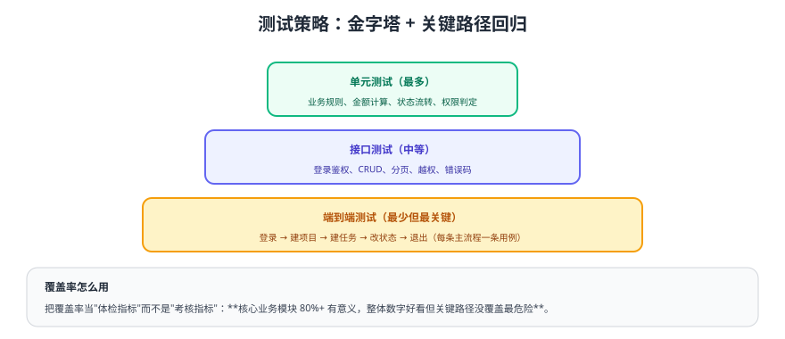

# 测试

测试的目标不是"覆盖率好看"，而是**关键路径不被改坏**。本页给出金字塔策略、示例项目的测试清单，以及可以直接照做的三类用例。



## 一、测试策略

| 层级 | 覆盖内容 | 工具建议 | 数量级 |
| --- | --- | --- | --- |
| 单元测试 | 业务规则（状态机、金额、权限判定） | JUnit / Vitest | 多 |
| 接口测试 | 登录鉴权、CRUD、分页、越权、错误码 | HTTP 客户端 / 自动化脚本 | 中 |
| 端到端 | 主流程（登录 → 建项目 → 建任务 → 改状态 → 退出） | Playwright / Cypress | 少而关键 |
| 手工回归 | 视觉、交互、兼容性 | 检查清单 | 发布前 |

::: tip 覆盖率怎么用
把覆盖率当"体检指标"：**核心业务模块 80%+ 有意义；整体数字好看但关键路径没覆盖最危险**。评审时看"哪些分支没测"，而不是只看总百分比。
:::

## 二、单元测试（后端状态机）

```java [TaskStatusServiceTest.java]
@SpringBootTest
class TaskStatusServiceTest {

    @Autowired TaskStatusService service;

    @Test
    void 允许_TODO_到_DOING() {
        assertDoesNotThrow(() -> service.changeStatus(1L, "DOING", 0, 100L));
    }

    @Test
    void 拒绝非法流转_DONE_到_TODO() {
        BizException ex = assertThrows(BizException.class,
                () -> service.changeStatus(1L, "TODO", 0, 100L));
        assertEquals(ErrorCode.ILLEGAL_STATUS_TRANSITION.getCode(), ex.getCode());
    }

    @Test
    void 非项目成员不能改状态() {
        BizException ex = assertThrows(BizException.class,
                () -> service.changeStatus(1L, "DOING", 0, 999L));   // 999 不是成员
        assertEquals(ErrorCode.NO_PERMISSION.getCode(), ex.getCode());
    }
}
```

## 三、接口测试清单

```shell
# 登录：拿到 token
TOKEN=$(curl -s -X POST http://localhost:8080/api/auth/login \
  -H 'Content-Type: application/json' \
  -d '{"username":"alice","password":"Passw0rd!"}' | jq -r '.data.accessToken')

# 未带 token：期望 401
curl -i http://localhost:8080/api/projects

# 带 token：期望 200 且 data.list 为数组
curl -s -H "Authorization: Bearer $TOKEN" http://localhost:8080/api/projects | jq '.code, .data.total'

# 越权：用 alice 的 token 改 bob 的项目：期望 403
curl -i -X PUT -H "Authorization: Bearer $TOKEN" -H 'Content-Type: application/json' \
  -d '{"name":"hacked"}' http://localhost:8080/api/projects/2002

# 非法状态流转：期望业务错误码
curl -s -X PATCH -H "Authorization: Bearer $TOKEN" -H 'Content-Type: application/json' \
  -d '{"status":"TODO","sort":0}' http://localhost:8080/api/tasks/3001/status | jq '.code, .message'
```

## 四、端到端用例（一条主流程）

```ts [e2e/main-flow.spec.ts（Playwright 风格伪代码）]
test('登录后创建项目与任务并流转状态', async ({ page }) => {
  await page.goto('/login')
  await page.fill('[name=username]', 'alice')
  await page.fill('[name=password]', 'Passw0rd!')
  await page.click('button[type=submit]')

  await expect(page).toHaveURL('/dashboard')

  await page.click('text=新建项目')
  await page.fill('[name=name]', 'E2E 项目')
  await page.click('text=保存')
  await expect(page.locator('.project-item', { hasText: 'E2E 项目' })).toBeVisible()

  await page.click('text=E2E 项目')
  await page.click('text=新建任务')
  await page.fill('[name=title]', 'E2E 任务')
  await page.click('text=保存')

  // 拖拽到「进行中」并确认落库
  await page.dragAndDrop('.task-card:has-text("E2E 任务")', '.column-doing')
  await page.reload()
  await expect(page.locator('.column-doing .task-card', { hasText: 'E2E 任务' })).toBeVisible()
})
```

## 五、发布前的回归清单

::: danger 发布前必须逐条确认
1. 单元测试与接口测试全部通过（CI 绿灯）。
2. 主流程 E2E 通过；本次改动涉及的模块额外手工走查一次。
3. 权限：低权限账号无法看到/调用受限资源（前后端各验一次）。
4. 数据：迁移脚本在"已有数据"的库上执行成功（不是只在空库验证）。
5. 异常：断网、超时、重复提交有可读提示，不白屏。
6. 回滚：应用与数据库都能退回上一版本，并演练过一次。
:::

## 验证方式

1. 执行 `mvn test`（或对应命令），确认单元测试全绿并记录覆盖率。
2. 按接口清单脚本逐条执行，确认状态码与业务码符合预期。
3. 运行一条 E2E 用例，确认从登录到状态流转全链路通过。
4. 故意制造一次失败（改错接口地址），确认测试能捕获并给出可定位的报错。

## 参考资料

- JUnit 5 用户指南：https://junit.org/junit5/docs/current/user-guide/
- Playwright 官方文档：https://playwright.dev/
- 本库 CI 集成：[CI/CD 专题](../../../../docs/Tools/CICD/index.md)
