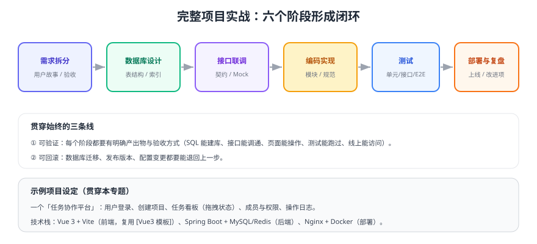

# 全栈项目实战

把 `docs/` 里学到的知识串成一次**完整交付**：需求拆分 → 数据库设计 → 前后端联调 → 编码 → 测试 → 部署 → 复盘。示例项目是一个「任务协作平台」，前端复用 [Vue3 模板](../../Base/Vue3Template/index.md)，后端使用 Spring Boot。

## 项目设定

| 项 | 内容 |
| --- | --- |
| 业务 | 任务协作平台：登录、项目、任务看板、成员与角色、操作日志 |
| 角色 | 管理员、项目负责人、普通成员 |
| 技术栈 | Vue 3 + Vite + TS + Element Plus；Spring Boot + MyBatis-Plus；MySQL + Redis |
| 部署 | Docker Compose（开发）/ Nginx + 应用服务（生产） |
| 不做什么 | 消息推送、附件管理、甘特图、移动端适配（后续迭代再做） |

::: tip 为什么要有"不做什么"
**范围失控是项目延期与质量滑坡的第一原因**。把"不做什么"写进项目文档，评审时才有据可依，也方便把新增需求放进下一迭代。
:::

## 章节导航

| 阶段 | 章节 | 核心产出 |
| --- | --- | --- |
| 1 | [需求拆分](Requirements/index.md) | 用户故事、优先级、验收标准 |
| 2 | [数据库设计](Database/index.md) | ER 关系、建表 SQL、索引与约束 |
| 3 | [接口联调](Api/index.md) | 接口契约、统一响应、Mock 与联调清单 |
| 4 | [编码实现](Development/index.md) | 登录、项目、任务、权限四个关键模块 |
| 5 | [测试](Testing/index.md) | 单元/接口/E2E 用例与回归清单 |
| 6 | [部署](Deployment/index.md) | 发布顺序、回滚、验收 |
| 7 | [复盘](Retrospective/index.md) | 量化指标、问题清单、改进项 |

## 迭代记录

| 日期 | 迭代内容 |
| --- | --- |
| 本次 | 建立项目骨架：完成需求拆分、数据库设计、接口联调、编码、测试、部署、复盘七个章节，覆盖 P0 功能闭环 |
| 计划 | 后续迭代补充：附件上传、消息通知、监控告警、多环境发布流水线、性能压测报告 |

## 验收标准（整体）

1. 从零执行文档中的命令，能拉起前端、后端与数据库，完成登录并创建项目。
2. 每个阶段都有"可验证的收尾"，例如建表 SQL 能执行、接口能用 `curl` 调通、E2E 用例能跑过。
3. 发布与回滚各演练一次，且记录耗时。
4. 复盘章节给出量化指标与明确的下一步动作。

## 相关专题

- 前端工程与模板：[Vue3 模板](../../Base/Vue3Template/index.md)
- 接口与调试：[接口调试工具](../../../docs/Tools/APITools/index.md)
- 数据库：[MySQL 专题](../../../docs/DB/Relational/MySQL/index.md)、[索引深入](../../../docs/DB/Relational/MySQL/IndexDeepDive/index.md)
- 认证与授权：[认证与授权专题](../../../docs/Backend/Auth/index.md)
- 测试与流水线：[CI/CD 专题](../../../docs/Tools/CICD/index.md)
- 部署：[Docker](../../../docs/Ops/Docker/index.md)、[Kubernetes](../../../docs/Ops/Kubernetes/index.md)
