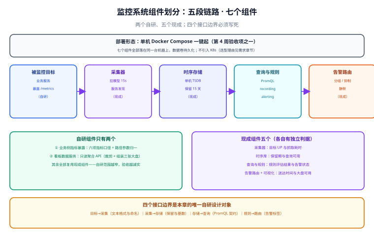

# 架构细化：五段链路拆成七个组件

第 121 天定的是**需求与选型**（要做什么、用什么做），本章回答**结构问题**：这五段链路到底由几个可独立部署的组件构成、它们之间靠什么契约连接、哪一个组件挂了会怎样。**本章是第 1 周唯一一次「先定边界再写代码」的机会**——边界定错了，第 2 周写出来的模块会互相咬合。

## 一句话定位

把「需求章节里的五段链路」落成**七个组件 + 四个接口边界**，并明确**只有两个组件需要自研**。

| 问题 | 本章的答案 |
| --- | --- |
| 谁负责采集 | 采集器（现成），业务侧只负责暴露指标 |
| 谁负责判定 | 查询与规则（现成），**规则与大盘复用同一套查询语言** |
| 谁负责通知 | 告警路由（现成）+ 自研通知适配层 |
| 自研有多少 | **两个**：业务侧指标暴露、看板数据服务 |
| 边界写在哪 | 四个接口契约（格式、命名、保留、告警标签） |

## 一、七个组件与职责



| # | 组件 | 现成 / 自研 | 职责 | 关键判据 |
| --- | --- | --- | --- | --- |
| C1 | 业务服务指标暴露 | **自研** | 暴露 `/metrics`，承载六项业务指标口径 | 指标名与标签规范一致；抓取耗时 < 500ms |
| C2 | 采集器 | 现成（拉模型） | 按 15s 间隔抓取目标，记录自身抓取状态 | 目标 `health=up`；抓取耗时进入指标 |
| C3 | 时序存储 | 现成（单机 TSDB） | 存样本、执行保留期策略 | `retention.time = 15d` 已生效 |
| C4 | 查询与规则 | 现成（与存储同源） | 提供查询语言、recording rule 与 alerting rule | 规则评估间隔可查；告警状态可查 |
| C5 | 告警路由 | 现成 | 分组、抑制、静默，负责「不吵」 | 从触发到送达 < 1 分钟 |
| C6 | 看板数据服务 | **自研** | 只读聚合 API：裁剪字段、组装三张大盘的数据 | 三张大盘所需查询全部可返回 |
| C7 | 可视化 | 现成（三张固定大盘） | 呈现看板数据服务与查询层的结果 | 首屏 < 3s；大盘不依赖手工调整 |

::: tip 为什么自研只有两个
自研范围越窄，**验收越诚实**：C1 与 C6 是本项目真正的业务价值所在（指标口径 + 大盘组织方式），其余五段如果是自研，第 3 周的「联调 + 压测」会变成「自己给自己排障」。而现成组件并不等于「不用设计」——**它们之间的边界同样要写死**，见下一节。
:::

## 二、四个接口边界（本章唯一需要设计的东西）

组件是现成的，但**边界必须自定义**。四个边界分别对应四个「一旦定错就返工」的位置：

### 2.1 边界一：目标 → 采集（文本格式与命名）

| 项 | 约定 | 定错的后果 |
| --- | --- | --- |
| 暴露格式 | 标准文本 exposition 格式（每行 `name{labels} value`） | 自造 JSON 需要额外转换器，第 2 周多一个模块 |
| 命名模板 | `app_request_total`、`app_request_duration_seconds` | 名字不自描述，看板上要逐个对文档 |
| 标签纪律 | **禁止把高基数字段做成标签**（用户 ID、订单号、原始路径） | 序列数爆炸，存储与查询一起崩（10 万篇文章 = 10 万个序列） |
| 路径归一 | `/api/v1/articles/{id}` 而不是真实 ID | 同上 |
| 抓取耗时 | 单次抓取 < 500ms | 抓取超时会让目标被判为 down，产生假告警 |

### 2.2 边界二：采集 → 存储（保留与基数）

| 项 | 约定 | 判据 |
| --- | --- | --- |
| 样本间隔 | 15s（与需求的一致） | 查询结果的时间粒度可验证 |
| 保留期 | **15 天**（启动参数显式指定） | 查询状态接口确认 `retention.time = 15d` |
| 基数上限 | 单目标活跃序列数有上限，超限要报警 | 检测查询能列出序列数最高的若干个标签组合 |
| 磁盘水位 | 预留容量 ≥ 1.5 × 预估占用 | 压测阶段验证（第 3 周） |

### 2.3 边界三：存储 → 查询（查询语言契约）

| 项 | 约定 | 为什么 |
| --- | --- | --- |
| **规则与大盘同源** | 大盘上的曲线与告警判定的查询**用同一种表达** | 避免「大盘上看着正常、告警却响了」这种最贵的分歧 |
| 时间窗口固定 | 三个固定窗口（5m / 1h / 24h），不自创 | 窗口数量爆炸会让看板与规则都得跟着改 |
| 查询超时 | 单次查询有超时，超过则返回明确错误 | 长查询会拖住存储，影响告警评估 |
| 聚合口径 | 明确用 `rate` / `increase` / 分位数中的哪一种 | 同一个指标两种算法，两个页面会给出不同结论 |

### 2.4 边界四：规则 → 路由（告警标签）

| 标签 / 字段 | 必须有的原因 | 缺了会怎样 |
| --- | --- | --- |
| `severity` | 分组与路由的第一依据 | 所有告警走同一条通道，运维会关掉通知 |
| `service` / `job` | 抑制的维度（同一服务的次生告警要压掉） | 一次故障炸出上百条告警 |
| `runbook_url` | 收到告警的人要能立刻找到处置步骤 | 值班的人先来问你「这个怎么办」 |
| `summary` / `description` | 通知内容必须自解释 | 告警内容是「某个表达式超过了阈值」，没人看得懂 |

::: danger 四个边界的共同纪律：**先写契约，再写实现**
这四个边界都不属于「现成组件」，而是**本项目的设计对象**。第 2 周开始写代码时，若发现某个边界需要改，**必须回来改本章并说明原因**——如果直接改实现，第 3 周联调时会出现「规则用的是窗口 A、大盘用的是窗口 B」这类只有对账才能发现的分歧。
:::

## 三、拓扑与部署单元

**一个部署单元（第 1 周口径）**：七个组件全部跑在同一台机器上，由一份 Compose 文件编排，数据卷持久化。

| 部署单元 | 包含 | 选择理由 |
| --- | --- | --- |
| 单机 Compose | 采集器 + 时序库 + 查询规则 + 告警路由 + 可视化 + 看板数据服务 | 项目要能**被交接**：一条命令起来、一条命令停掉 |
| 业务服务 | 被监控目标（复现时用最小桩服务即可） | 不把「被监控目标」算进本项目组件 |
| 明确不做 | K8s 编排、多副本、远程存储、跨机房 | 需求章节已登记为「不做」，避免范围蔓延 |

## 四、一次完整数据流的追踪

用「用户在文章页发起一次请求，到运维收到一条告警」把七个组件串起来——**这条链路的每一跳都对应一个组件与一个边界**：

| 步 | 发生什么 | 经过的组件 | 对应边界 |
| --- | --- | --- | --- |
| 1 | 业务处理请求，计数器 +1 | C1 | 边界一（命名与标签） |
| 2 | 采集器在下一个 15s 间隔抓取该目标 | C2 | 边界一 → 二 |
| 3 | 样本写入时序库并保留 15 天 | C3 | 边界二 |
| 4 | 规则在评估周期内发现错误率超过阈值 | C4 | 边界三 |
| 5 | 告警带上 `severity` / `service` / `runbook_url` 发往路由 | C4 → C5 | **边界四** |
| 6 | 路由按分组与抑制决定「发一条还是发十条」 | C5 | 边界四 |
| 7 | 通知送达（邮件 / Webhook），同时大盘上出现同一条曲线 | C5 + C7 | 验收：送达 < 1 分钟 |

::: tip 这条链路本身就是验收脚本
第 3 周的端到端联调不需要另想测试用例：**按 1→7 的顺序逐跳验证**，每一跳都有可查的证据（指标存在、样本存在、规则状态变化、告警状态变化、通知到达、曲线可见）。这也是 US-05（我想知道指标是不是真的在采集）与 US-10（监控系统自己是否正常）在架构上的落点。
:::

## 五、失败模式矩阵

架构评审真正要回答的问题是：**某个组件挂了会怎样，我们能不能接受。**

| 组件 | 挂掉的表现 | 可接受吗 | 处置 |
| --- | --- | --- | --- |
| C1 指标暴露 | 该目标被判 down，触发「采集失败」告警 | **可接受** | 这正是「它已经不采集了但没人发现」的防线（US-05） |
| C2 采集器 | 所有曲线停止更新，**看板上看不出异常**（曲线只是变平） | **不可接受** | 必须有「采集器自身」的独立监控任务与告警 |
| C3 时序库 | 查询失败、写入失败 | 不可接受 | 独立监控任务 + 磁盘水位告警 |
| C4 规则引擎 | 大盘正常，**告警不响** | **不可接受** | 规则评估失败的告警；告警状态提供接口可查 |
| C5 告警路由 | 告警不送达 | 不可接受 | 路由自身的健康检查 + 定期演练「真的响一次」 |
| C6 看板数据服务 | 大盘部分面板空白 | **可接受** | 返回明确错误而不是空数据（空数据会被误读成「一切正常」） |
| C7 可视化 | 看不了，但告警仍能送达 | 可接受 | 优先级最低 |

::: danger 最危险的失败不是「挂了」，而是「看起来正常」
监控系统特有的失败模式是**静默失效**：采集停了曲线变平、规则挂了告警不响、看板服务返回空数组——这三种在界面上都表现为「很正常」。所以本章的失败矩阵里，**每一个「不可接受」项都必须在第 3 周落成一条可触发的告警**（这也是需求章节 US-10 的验收对象）。
:::

## 六、本日可验证构建步骤

把本章的架构**落成可运行的骨架**并验证边界能被机器识别（不需要业务代码）：

### 第一步：写编排文件，把七个组件里可现成起的五个先起来

```yaml [deploy/compose.yaml]
services:
  metrics-collector:
    image: prom/prometheus:v3.5.0            # 以本地实际拉到的版本为准
    command:
      - --config.file=/etc/prometheus/prometheus.yml
      - --storage.tsdb.retention.time=15d
      - --web.enable-lifecycle
    volumes:
      - ./prometheus.yml:/etc/prometheus/prometheus.yml:ro
      - tsdb:/prometheus
    ports: ["9090:9090"]
    healthcheck:
      test: ["CMD", "wget", "-qO-", "http://localhost:9090/-/healthy"]
      interval: 10s
      retries: 5
  alert-router:
    image: prom/alertmanager:v0.28.1
    volumes: ["./alertmanager.yml:/etc/alertmanager/alertmanager.yml:ro"]
    ports: ["9093:9093"]
  dashboard:
    image: grafana/grafana:12.1.0
    ports: ["3000:3000"]
    volumes: ["grafana:/var/lib/grafana"]
volumes:
  tsdb:
  grafana:
```

### 第二步：写采集配置，落实边界一与自监控任务

```yaml [deploy/prometheus.yml]
global:
  scrape_interval: 15s
scrape_configs:
  - job_name: self                      # 采集器自监控（失败矩阵里 C2 的防线）
    static_configs:
      - targets: ["localhost:9090"]
  - job_name: app
    static_configs:
      - targets: ["app:8080"]           # 复现时的最小桩服务
    metrics_path: /metrics
```

### 第三步：起链路并确认五个组件都在

```shell
cd deploy && docker compose up -d
docker compose ps --format 'table {{.Name}}\t{{.Status}}'
```

预期：采集器、路由、可视化三个服务均为 `Up (healthy)` 或 `Up`；若某个服务反复重启，先看 `docker compose logs <name>` 的前 20 行——**配置解析错误会带行号，这是最容易修的一类失败**。

### 第四步：按四个边界逐条验证（每条都有明确证据）

```shell
# 边界一/二：自监控目标是否 UP，抓取耗时是否在预算内
curl -s http://localhost:9090/api/v1/targets \
  | grep -o '"job":"[^"]*","[^"]*"health":"[^"]*"' | head -4
# 期望：self 与 app 两个任务都存在（app 未起时应为 down，这是**正确**行为）

# 边界二：保留期是否真的生效
curl -s http://localhost:9090/api/v1/status/flags | grep -o '"storage.tsdb.retention.time":"[^"]*"'
# 期望："15d"

# 边界三：查询可用（规则与大盘同源的那套查询语言）
curl -s 'http://localhost:9090/api/v1/query?query=prometheus_sd_configs_failed_total' | head -c 200
# 期望：{"status":"success", ...}；status 为 error 时先看 errorType

# 边界四：路由就绪（告警标签的落点）
curl -s http://localhost:9093/api/v2/status | head -c 200
# 期望：返回路由自身的状态 JSON（含 cluster 状态）
```

### 第五步：验证「静默失效」会被发现

```shell
# 停掉被监控目标，确认「采集失败」是**可见的**（而不是曲线悄悄变平）
docker compose stop app
sleep 20
curl -s http://localhost:9090/api/v1/targets \
  | grep -o '"job":"app","[^}]*"health":"[^"]*"' | head -1
# 期望：health 变为 "down" —— 这一步证明失败矩阵里 C1/C2 那一行成立
docker compose start app
```

### 判据小结

| 步骤 | 命令 | 期望 | 对应边界 |
| --- | --- | --- | --- |
| 起链路 | `docker compose ps` | 三个服务 Up | 部署形态 |
| 目标可见 | `/api/v1/targets` | `self` 存在；`app` 随状态变化 | 边界一 |
| 保留生效 | `/api/v1/status/flags` | `retention.time = 15d` | 边界二 |
| 查询可用 | `/api/v1/query` | `status: success` | 边界三 |
| 路由就绪 | `/alertmanager/api/v2/status` | 状态 JSON 可返回 | 边界四 |
| 静默失效可见 | 停目标后查 targets | `health = down` | 失败矩阵 C1/C2 |

::: warning 实测列纪律
上表是**判据**，不是实测记录。本机没有可用容器运行时，实测列一律写 `⏳ 阻塞 + 原因`，**不把期望值抄进实测列**——这与第 4 周收口时的口径完全一致。
:::

## 当日做了什么

1. 把五段链路拆成**七个组件**，逐个标注「现成 / 自研」，明确**自研只有两个**（业务指标暴露、看板数据服务），据此收敛第 2 周的编码范围。
2. 定稿**四个接口边界**（目标→采集、采集→存储、存储→查询、规则→路由），每条都写明「定错的后果」，并确立「先改契约再改实现」的纪律。
3. 画出一张组件划分图（`components.svg`），把「谁是现成、谁是自研、四个边界在哪」画在同一张图上。
4. 用「一次请求 → 一条告警」把七个组件串成**七步数据流**，作为第 3 周端到端联调的现成用例。
5. 产出**失败模式矩阵**，逐个判定「可接受 / 不可接受」，并把三个「不可接受」项（采集器、规则、路由）登记为第 3 周必须能触发的告警。
6. 给出本日可验证构建步骤：Compose 骨架 → 采集配置（含自监控任务）→ 起链路 → 四条边界逐条验证 → 停目标验证「静默失效可见」。

## 如何验证

本日的验证即上面「本日可验证构建步骤」的六条判据，全部可在本机 10 分钟内完成。核心是两条：

1. `/api/v1/status/flags` 返回 `retention.time = 15d`——**保留策略写错不会报错，只会悄悄撑满磁盘**，所以必须有一步显式验证；
2. 停掉被监控目标后 `/api/v1/targets` 中该任务 `health` 变为 `down`——证明「采集失效」是**可见的**，这是整个项目最值钱的一条防线。

两条都通过，说明架构边界不只是纸面约定，而是能被机器识别与验证的契约，第 2 周可以直接在骨架上叠加采集与规则模块。

## 下一步（第 123-127 天）

1. **数据模型与保留策略**（第 123 天）：时序数据点、序列与标签的存储结构，保留期与降采样策略，落在边界二上。
2. **标签与命名规范定稿**（第 124 天）：把草案变成可校验的规范，给出高基数检测方法，落在边界一上。
3. **采集任务与配置**（第 125 天）：服务发现方式、任务分组、抓取失败的处理与告警，落在边界二与失败矩阵 C2 上。
4. **查询与规则设计**（第 126 天）：recording rule 与 alerting rule 的划分、评估间隔、抑制与分组，落在边界三与边界四上。
5. **接口契约与工程骨架**（第 127 天）：看板数据服务的接口定义与多模块骨架，第 1 周收口；同时把本章的四个边界落成代码里的常量与校验。

## 参考资料

- [监控告警专题](/docs/Ops/Monitoring/index.md)：指标类型、抓取模型与告警规则设计的方法论（本项目不重复讲原理）
- [需求拆分与技术选型](../Requirements/index.md)：本项目的用户故事、范围边界与技术选型论证
- [完整项目交付](/docs/Others/ProjectDelivery/index.md)：契约先行、判据编号化与交付物清单的方法论
- [后端通用模板](../../../Base/BackendTemplate/index.md)：看板数据服务复用的后端基座
- Prometheus 官方文档 · 配置与保留策略：https://prometheus.io/docs/prometheus/latest/configuration/configuration/
- Prometheus 官方文档 · 命名与标签最佳实践：https://prometheus.io/docs/practices/naming/
