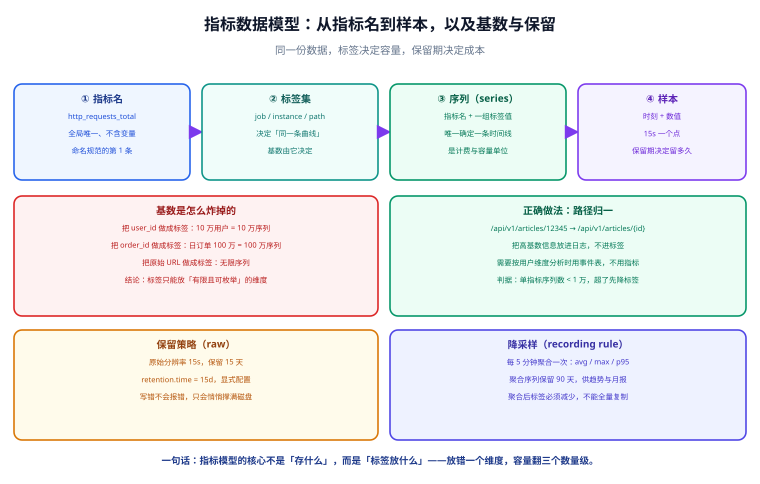

# 指标模型与保留策略

**第 123 天要解决的是「数据长什么样」**：上一章把链路拆成了七个组件与四个接口边界，这一章回答边界二（采集 → 存储）里的具体问题——**指标在时序库里到底存成什么结构、标签放什么、保留多久、降采样怎么做**。答案是三句话：**指标模型的核心不是「存什么」而是「标签放什么」；保留期必须显式配置；聚合必须减少标签而不是复制标签。**



## 一句话定位

**指标是一条由「指标名 + 一组标签」唯一确定的时间线，样本只是它上面的点。** 因此定容量的不是「采了多少点」，而是「有多少条线」——这就是为什么标签规范比采集频率重要得多。

## 与第 122 天的分工

| 第 122 天（架构细化） | 第 123 天（本章） |
| --- | --- |
| 定组件与边界：谁能读写谁、边界定错的后果 | 定落在边界二上的**数据模型**：结构、标签、保留、降采样 |
| 给出「七步数据流」与失败模式矩阵 | 给出指标字典与命名规范定稿，使边界一与边界二**可被机器校验** |
| 验证方式是「起链路 + 查四条边界」 | 验证方式是「写入自定义指标 + 查保留策略 + 跑字典一致性 SQL」 |

## 一、时序数据的四个对象

时序数据只有四层，任何时序库（Prometheus、InfluxDB、TDengine、VictoriaMetrics）都是这四层：

| 对象 | 是什么 | 唯一性由谁保证 | 常见误区 |
| --- | --- | --- | --- |
| 指标名（metric） | 度量的名字，如 `http_requests_total` | 全局唯一，**不能含变量** | 把 `user_id` 拼进指标名（如 `req_user_10086`）→ 指标数量爆炸 |
| 标签（label） | 维度键值对，如 `job="app"` | 键值对集合 | 把无限集合（订单号、URL 原始路径）做成标签 |
| 序列（series） | 指标名 + 一组标签值 | **`指标名 + 标签集` 唯一确定** | 以为「序列数 = 指标数」，实际是「指标数 × 标签组合数」 |
| 样本（sample） | `(时刻, 数值)` | 序列内按时刻唯一 | 以为提高采集频率能解决精度问题，实际先炸的是容量 |

::: tip 与关系库的对照
把时序库想成一张超宽的表会更容易理解：**指标名是表名，标签是索引列，样本是行**。区别在于关系库要先建表、维度是列；时序库是**标签即模式（schema-less by labels）**，你写的每条标签都会立刻创造新的序列，不需要 DDL——**这既是它的便利，也是它最大的危险**。
:::

## 二、标签决定一切：基数是怎么炸掉的

**基数（cardinality）= 一个指标下不同标签组合的数量 = 序列数。** 它是时序库容量与查询性能的唯一主导因素，也是最容易失控的地方。

| 标签示例 | 取值规模 | 序列规模 | 判定 |
| --- | --- | --- | --- |
| `job` | 3~10 | 3~10 | ✅ 安全 |
| `instance` | 机器数 | 几十~几百 | ✅ 安全 |
| `path`（归一后） | 接口数 | 几十~几百 | ✅ 安全 |
| `status_code` | 5~10 | 5~10 | ✅ 安全 |
| `path`（未归一） | URL 空间 | 无上限 | ❌ 危险 |
| `user_id` | 用户数 | 10 万~千万 | ❌ 危险 |
| `order_id` | 订单数 | 百万级 | ❌ 危险 |

```text
容量估算（务必写进设计文档）：
  单序列 = 样本数 × 每样本字节数
         = (保留秒数 / 采集间隔) × ≈ 1.5~2 B（压缩后）
  保留 15 天、间隔 15s：86400 点/天 × 15 天 ≈ 129.6 万点 ≈ 2~2.6 MB/序列
  1 万序列 → 20~26 GB；10 万序列 → 200~260 GB
```

::: danger 三个必须写进规范的禁令
1. **禁止把高基数字段做成标签**。`user_id` / `order_id` / `session_id` / `trace_id` 一律不得进入标签；需要按这些维度分析时用**日志或事件表**，不用指标。
2. **禁止把原始 URL 做成标签**。必须归一：`/api/v1/articles/12345` → `/api/v1/articles/{id}`；未归一的 `path` 标签会让序列数随业务数据无上限增长。
3. **禁止把标签设计交给「顺手」。** 每新增一个标签，都要在指标字典里登记「取值范围」与「预估基数」；没有登记的标签不允许上线。
:::

## 三、指标字典：让口径可治理

指标一旦上线就很难改（改名字等于断历史曲线），所以**必须在写第一条指标前把字典建起来**。字典不放在时序库里，而是放在业务库（关系库），由看板数据服务读取，用于「大盘可追溯」。

```sql [V1__metric_dict.sql]
-- 指标字典：每一个指标的唯一登记处
CREATE TABLE metric_def (
  metric_name   VARCHAR(128) NOT NULL COMMENT '指标名，如 http_requests_total',
  metric_type   VARCHAR(16)  NOT NULL COMMENT 'COUNTER / GAUGE / HISTOGRAM / SUMMARY',
  unit          VARCHAR(16)  NOT NULL DEFAULT 'count' COMMENT '单位：count / seconds / bytes / ratio',
  owner         VARCHAR(64)  NOT NULL COMMENT '归属团队/负责人，没人认领的指标不许上线',
  description   VARCHAR(255) NOT NULL COMMENT '口径说明：这个数「算的是什么」',
  sli           TINYINT(1)   NOT NULL DEFAULT 0 COMMENT '是否作为 SLI 参与 SLO 计算',
  status        VARCHAR(16)  NOT NULL DEFAULT 'ACTIVE' COMMENT 'ACTIVE / DEPRECATED',
  deprecated_at DATETIME     NULL     COMMENT '废弃时间：废弃后仍保留历史，但不再新增采集',
  create_time   DATETIME     NOT NULL DEFAULT CURRENT_TIMESTAMP,
  PRIMARY KEY (metric_name)
) ENGINE=InnoDB DEFAULT CHARSET=utf8mb4 COMMENT='指标字典';

-- 标签字典：每个指标的每个标签都必须登记取值范围与预估基数
CREATE TABLE metric_label_def (
  metric_name   VARCHAR(128) NOT NULL,
  label_name    VARCHAR(64)  NOT NULL,
  required      TINYINT(1)   NOT NULL DEFAULT 1 COMMENT '是否必填',
  cardinality   INT          NOT NULL COMMENT '预估基数，用于容量核算',
  bounded       TINYINT(1)   NOT NULL DEFAULT 1 COMMENT '取值是否有限可枚举（0 表示高危，必须给理由）',
  value_regex   VARCHAR(255) NOT NULL COMMENT '取值必须匹配的正则，用于采集端校验',
  sample_values VARCHAR(255) NOT NULL COMMENT '示例取值，便于人类理解',
  reason        VARCHAR(255) NULL     COMMENT 'bounded=0 时必须填写理由',
  PRIMARY KEY (metric_name, label_name),
  CONSTRAINT fk_label_metric FOREIGN KEY (metric_name) REFERENCES metric_def (metric_name)
) ENGINE=InnoDB DEFAULT CHARSET=utf8mb4 COMMENT='标签字典';

-- 规范登记示例：三条边界一的核心指标
INSERT INTO metric_def(metric_name, metric_type, unit, owner, description, sli) VALUES
  ('http_requests_total', 'COUNTER', 'count', 'backend',   '按接口、方法、状态码统计的请求总数', 1),
  ('http_request_duration_seconds', 'HISTOGRAM', 'seconds', 'backend', '接口耗时分布（用于 p95/p99）', 1),
  ('app_up', 'GAUGE', 'ratio', 'ops', '应用实例存活（1/0），由采集器直接判定', 1);

INSERT INTO metric_label_def(metric_name, label_name, required, cardinality, bounded, value_regex, sample_values, reason) VALUES
  ('http_requests_total', 'job',        1, 5,   1, '^[a-z][a-z0-9_]*$',            'app,gateway', NULL),
  ('http_requests_total', 'instance',   1, 20,  1, '^[a-z0-9.-]+:[0-9]+$',         'app-1:8080',  NULL),
  ('http_requests_total', 'method',     1, 7,   1, '^(GET|POST|PUT|PATCH|DELETE|HEAD|OPTIONS)$', 'GET,POST', NULL),
  ('http_requests_total', 'path',       1, 300, 1, '^/[a-zA-Z0-9/{}._-]*$',       '/api/v1/articles/{id}', NULL),
  ('http_requests_total', 'status_code',1, 8,   1, '^[1-5][0-9]{2}$',              '200,404,500', NULL);
```

::: danger 字典本身的两个陷阱
1. **字典与代码是两份真相**。采集端暴露的标签如果不在字典里，规范就是一纸空文。**必须有一道校验**：`app_up` 之外的所有指标名与标签名都必须能在字典里查到，否则采集端 CI 失败（本章第 6 节的判据 ⑤ 就是它的简化版）。
2. **`bounded=0` 的标签被当成「允许」。** 字典允许登记无限基数的标签，但**必须填 `reason`**；没有理由的无限基数标签应当在评审时被拒。判据：`SELECT * FROM metric_label_def WHERE bounded = 0 AND reason IS NULL;` 必须为空。
:::

## 四、命名与标签规范（定稿）

第 121 天给的只是草案，本节把它变成**可被正则校验的规范**。

| 规则 | 内容 | 校验方式 |
| --- | --- | --- |
| 命名格式 | `^[a-z][a-z0-9_]*$`，单词间用 `_`，小写 | 正则 |
| 单位后缀 | 时间用 `_seconds`、字节用 `_bytes`、比例用 `_ratio`（不带后缀的默认为 `count`） | 命名白名单 |
| 计数器后缀 | 单调递增的计数器必须以 `_total` 结尾 | 后缀检查 |
| 标签命名 | `^[a-z][a-z0-9_]*$`；禁止 `__` 开头（保留前缀） | 正则 |
| 必带标签 | 每个指标必须带 `job` 与 `instance` | 字典 `required=1` |
| 禁止标签 | `user_id`/`order_id`/`session_id`/`trace_id`/`path`（原始未归一） | 黑名单 |

```text
命名示例对比：
  ✅ http_requests_total{job="app",instance="app-1:8080",method="GET",path="/api/v1/articles/{id}",status_code="200"}
  ✅ http_request_duration_seconds_bucket{...}
  ✅ app_db_pool_active_connections{job="app",instance="app-1:8080",pool="primary"}
  ❌ httpRequestsTotal                       （驼峰，违反命名格式）
  ❌ http_requests{...}                      （计数器缺 _total 后缀）
  ❌ http_requests_total{path="/api/v1/articles/12345"}   （路径未归一）
  ❌ http_requests_total{user_id="10086"}    （高基数标签）
```

::: warning 历史曲线不可改名
指标名一旦上线，改名等于「历史数据断层」。所以**规范必须在写第一条指标前定稿**，且字典里要有 `status=ACTIVE/DEPRECATED` 与 `deprecated_at`——废弃是「停止新增但保留历史」，不是删掉重来。判据：任何一个历史时间点的大盘，都能在字典里查到当时使用的指标名。
:::

## 五、保留策略与降采样

原始分辨率数据只用于「查最近发生了什么」，长期趋势必须靠降采样（recording rule）。**两层数据、两种保留期**是本节的核心结论。

| 层 | 数据 | 分辨率 | 保留期 | 用途 |
| --- | --- | --- | --- | --- |
| raw | 原始样本 | 采集间隔 15s | **15 天（显式配置）** | 排障、看最近异常、告警评估 |
| 聚合 | recording rule 产出 | 5 分钟 | 90 天 | 趋势、容量规划、月报 |
| 长期 | 月度归档 | 1 小时 / 1 天 | 1~3 年 | 年度对比（本期「明确不做」，见需求章节） |

```yaml [deploy/compose.yaml]
services:
  metrics:
    image: prom/prometheus:v3.5.0
    command:
      - --config.file=/etc/prometheus/prometheus.yml
      - --storage.tsdb.path=/prometheus
      # 保留策略必须显式写死：写错不会报错，只会悄悄撑满磁盘
      - --storage.tsdb.retention.time=15d
      - --storage.tsdb.retention.size=20GB
      - --web.enable-lifecycle
    volumes:
      - ./prometheus.yml:/etc/prometheus/prometheus.yml:ro
      - metrics-data:/prometheus
    ports:
      - "127.0.0.1:9090:9090"
    healthcheck:
      test: ["CMD", "wget", "-qO-", "http://127.0.0.1:9090/-/healthy"]
      interval: 10s
      timeout: 3s
      retries: 6
volumes:
  metrics-data:
```

```yaml [deploy/rules/recording.yaml]
groups:
  - name: recording
    interval: 5m
    rules:
      # 降采样：把 15s 的原始样本聚合成 5 分钟一个点
      - record: job:http_requests:rate5m
        expr: sum by (job, path, status_code) (rate(http_requests_total[5m]))
      - record: job:http_request_duration:p95_5m
        expr: histogram_quantile(0.95, sum by (job, le) (rate(http_request_duration_seconds_bucket[5m])))
```

::: danger 降采样的三条纪律
1. **聚合必须用 `by` 明确保留哪些标签，绝不 `without` 全量保留。** 用 `without(instance)` 这类写法时，一旦上游新增标签就会自动带进聚合结果，聚合序列基数随之膨胀——**降采样的目的是减少标签，不是复制标签**。
2. **`rate()` 必须配足够长的窗口。** 窗口小于 `4 × 采集间隔` 时，遇到一次抓取失败就会产生断点与尖刺；15s 间隔至少要 `1m`，跨实例聚合建议 `5m`。
3. **聚合序列不能被反向当成原始数据用。** 5 分钟粒度的 `p95` 无法还原「某一秒的毛刺」；排障必须回到 raw 层，且 raw 层只有 15 天——**这就是 15 天保留期的业务含义**。
:::

## 六、当日可验证构建步骤

本日产出可以完全在本地验证（需要容器运行时）。六步判据如下：

```shell
# ① 起链路（在 deploy/ 目录）
docker compose up -d
docker compose ps                     # 期望：三个服务 Up (healthy)

# ② 写入一条自定义指标：向应用的 /metrics 端点暴露本章规范里定义的三条指标
curl -s http://127.0.0.1:8080/metrics | grep -E '^(http_requests_total|app_up)' 
# 期望：http_requests_total 带齐 job/instance/method/path/status_code 五个标签；
#       path 的取值是归一形式（含 {id}），不是数字 ID

# ③ 保留策略生效
curl -s http://127.0.0.1:9090/api/v1/status/flags | grep -o '"retention.time":"[^"]*"'
# 期望："retention.time":"15d"

# ④ 查询可用：用归一后的 path 查速率
curl -s 'http://127.0.0.1:9090/api/v1/query?query=job:http_requests:rate5m' | head -c 400
# 期望：status":"success" 且 result 非空（聚合规则已产出序列）

# ⑤ 字典一致性：代码暴露的指标必须都在字典里（下面这条 SQL 返回空才是对的）
mysql -u app -p dashboard -e "
SELECT e.metric_name FROM metric_exposed_runtime e
LEFT JOIN metric_def d ON d.metric_name = e.metric_name
WHERE d.metric_name IS NULL;"

# ⑥ 高基数体检：序列数按指标名排序，观察是否有异常膨胀的指标
curl -s 'http://127.0.0.1:9090/api/v1/query?query=count(count by(__name__)({__name__=~".+"}))' | head -c 300
curl -s 'http://127.0.0.1:9090/api/v1/query?query=topk(5,count by(__name__)({__name__=~".+"}))' | head -c 500
# 期望：http_requests_total 的序列数 < 1 万；若远超，先查 path 是否归一
```

::: warning 步骤 ⑤ 的 `metric_exposed_runtime` 是读者自建的
按本项目「`project/` 只写文档」的约定，仓库不提供该表与脚本。读者需要在**自己的工程**里：由采集端在启动时把「本次暴露的指标名 + 标签」写入 `metric_exposed_runtime`（或由 CI 扫描 `/metrics` 输出后入库），再执行这条一致性 SQL。**这一步是「规范可被机器校验」的落地方式**，也是本章区别于「写一份规范文档」的关键。
:::

## 七、判据表

| # | 判据 | 命令 / 断言 | 期望 | 实测 | 结论 |
| --- | --- | --- | --- | --- | --- |
| MM1 | 链路可起 | `docker compose ps` | 三个服务 Up | ⏳ 未跑：本机无容器运行时 | ⏳ |
| MM2 | 自定义指标可暴露 | `curl /metrics \| grep http_requests_total` | 五个标签齐全 | ⏳ 同上 | ⏳ |
| MM3 | 路径已归一 | 检查 `path` 取值 | 含 `{id}`，无数字 ID | ⏳ 同上 | ⏳ |
| MM4 | 保留策略为 15d | `/api/v1/status/flags` | `retention.time = 15d` | ⏳ 同上 | ⏳ |
| MM5 | 降采样规则产出 | 查询 `job:http_requests:rate5m` | `status: success` 且 result 非空 | ⏳ 同上 | ⏳ |
| MM6 | 聚合减少标签 | 对比 raw 与聚合序列数 | 聚合序列数明显更小 | ⏳ 同上 | ⏳ |
| MM7 | 字典一致性 | 一致性 SQL | 返回空集 | ⏳ 同上 | ⏳ |
| MM8 | 无高危标签 | `bounded=0 AND reason IS NULL` | 返回空集 | ⏳ 同上 | ⏳ |
| MM9 | 单指标序列数受控 | `topk` 查询 | 无指标超过 1 万序列 | ⏳ 同上 | ⏳ |

::: warning 实测列纪律（第三次重申）
上表全部标 `⏳`，原因是**本机没有可用的容器运行时**，无法启动采集器与时序库。**判据不是实测记录**：不把期望值抄进实测列，也不因为「设计上应该成立」就标 ✅。第 4 周收口时会带着同一张表一次性回填。
:::

## 八、当日做了什么

1. **定稿时序数据模型**：把「指标名 / 标签 / 序列 / 样本」四层与关系库对照讲清，明确**序列数 = 指标数 × 标签组合数**这一容量主导因素，并给出可写进设计文档的容量估算公式。
2. **量化基数风险**：用「10 万用户 = 10 万序列」把「把 `user_id` 做成标签」的后果算出来，并给出路径归一的正确写法（`/api/v1/articles/{id}`）。
3. **把规范变成可校验对象**：设计 `metric_def` 与 `metric_label_def` 两张字典表（含 `bounded` / `reason` / `value_regex` / `cardinality`），并把三条核心指标的五类标签按规范登记入库。
4. **固化命名与标签规范**（从第 121 天的草案升级为定稿）：命名格式、单位后缀、`_total` 后缀、必带标签、禁止标签，每条都给出正则或白名单校验方式。
5. **定下保留与降采样两层策略**：raw 15s / 15 天（`retention.time` 与 `retention.size` 双显式），聚合 5 分钟 / 90 天，并给出 `compose.yaml` 与 `recording.yaml` 的完整内容。
6. **给出六步可验证构建步骤**：起链路 → 暴露自定义指标 → 查保留策略 → 查聚合规则 → 跑字典一致性 SQL → 做高基数体检，并为每步写明期望输出。

## 九、如何验证

本日的验证即上表 MM1~MM9 九条判据，全部可用一条命令或一条 SQL 得到明确结论。最值得强调的是 **MM4 与 MM7**：

1. **MM4（保留策略）**：`retention.time` 写错**不会报错**，只会让磁盘在某一天被写满。所以保留策略必须有一步显式验证——这与第 122 天验证 `retention.time = 15d` 是同一条防线，本章把它固化进判据表。
2. **MM7（字典一致性）**：它是本章唯一一条「让规范自动生效」的判据。没有它，命名规范会随着人员更替而失真；有了它，新增一个未登记的标签会让 CI 直接失败。

两条都通过，说明数据模型不只是纸面规范，而是**可被机器校验的契约**，第 2 周可以直接在它上面实现采集模块与看板数据接口。

## 十、下一步（第 124-127 天）

1. **标签与命名规范落地校验**（第 124 天）：把本章的字典表接进 CI，实现「暴露的指标必须已登记」的自动门禁，并给出高基数自动检测任务。
2. **采集任务与配置**（第 125 天）：服务发现方式、任务分组、抓取失败的告警，落在边界二与失败模式 C2 上。
3. **查询与规则设计**（第 126 天）：recording rule 与 alerting rule 的划分、评估间隔、抑制与分组，落在边界三与边界四上；本章的 `recording.yaml` 是它的输入。
4. **接口契约与工程骨架**（第 127 天）：看板数据服务的接口定义与多模块骨架，第 1 周收口；字典表通过该服务对外提供「指标口径」查询。

## 参考资料

- [监控告警专题](/docs/Ops/Monitoring/index.md)：指标类型与抓取模型的方法论（本项目不重复讲原理）
- [时序数据库专题](/docs/DB/TimeSeries/index.md)：时序模型、降采样与保留策略的通用原理
- [数据建模专题](/docs/DB/DataModeling/index.md)：字典表与关系建模的规范来源
- [架构细化：组件与接口边界](../Architecture/index.md)：本章落实的是其中的边界一与边界二
- [需求拆分与技术选型](../Requirements/index.md)：非功能需求里的「保留 15 天」出自这里
- Prometheus 官方文档 · 配置（`storage.tsdb.retention.time`）：https://prometheus.io/docs/prometheus/latest/configuration/configuration/
- Prometheus 官方文档 · 命名与标签最佳实践：https://prometheus.io/docs/practices/naming/
- Prometheus 官方文档 · Recording rules：https://prometheus.io/docs/prometheus/latest/configuration/recording_rules/
