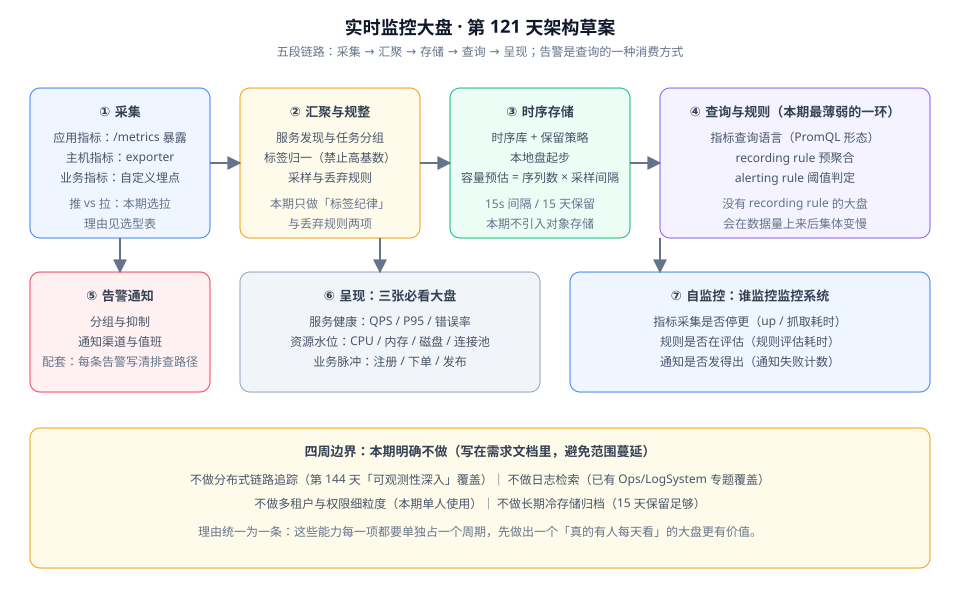

# 需求拆分与技术选型

周期 5（第 121-150 天）的第 1 天。本日产出两件东西：**一份能被验收的需求文档**，以及**一条能在本机跑通的最小采集链路**。后者是本周的技术风险探针——采集链路不通，后面四周都是在猜。

::: tip 一句话定位
需求拆分的产物不是「功能列表」，而是**一组能证伪的验收条件**与**一份明确的「不做什么」清单**。技术选型的产物不是「用了什么」，而是**每个选择被放弃的备选是什么、为什么放弃**。
:::

## 三类用户与他们的关注点

监控系统的需求不能靠「一般用户」推导，必须按角色拆开——**同一张大盘对三个人意味着完全不同的东西**。

| 角色 | 什么时候会打开它 | 想回答的问题 | 对系统的要求 |
| --- | --- | --- | --- |
| **值班工程师** | 告警响起时、交接班前 | 「现在有没有问题？是哪一层的问题？」 | 首屏 5 秒内能看出「是否异常」；从大盘到根因的路径明确 |
| **开发工程师** | 发版后、排查自己模块的问题时 | 「我的改动有没有让延迟变差？」 | 能按服务/接口维度切分；能对比发版前后的同一指标 |
| **技术负责人** | 每周、大促前 | 「容量还够用多久？哪里的增长最快？」 | 有趋势视图；有容量水位与预测口径；不依赖个人经验解读 |

::: warning 为什么要把角色写进需求文档
「做一个监控大盘」这句话里没有用户。而**没有用户的需求无法验收**——你无法判断「做完了没有」。
上面这张表的作用是：后面每一条用户故事都指定一个主角色；如果一个功能说不清「谁在什么时候用它」，它就不该进本期范围。
:::

## 范围边界

### 本期做什么

一句话概括五段链路：**采集 → 汇聚规整 → 时序存储 → 查询与规则 → 呈现与通知**。



### 本期明确不做

| 不做的事 | 为什么不做 | 由谁覆盖 |
| --- | --- | --- |
| 分布式链路追踪 | 它需要改造所有被监控服务并引入 Trace 存储，工作量等于本项目本身 | 第 144 天「可观测性深入」专题 |
| 日志采集与检索 | 已有成熟方案与独立专题，重复建设没有价值 | [日志体系专题](/docs/Ops/LogSystem/index.md) |
| 多租户与细粒度权限 | 本期使用人数是个位数，权限模型是纯粹的开销 | 不覆盖（后续按需） |
| 长期冷存储归档 | 15 天保留已足够回答本期的全部问题 | 不覆盖 |

::: danger 范围蔓延的三种典型说法
1. **「反正采集器都有了，顺手把日志也收了吧」**——日志与指标的数据模型、存储、查询语言完全不同，共用采集器不等于共用系统。正确做法是明确写进「不做」清单并注明替代方案。
2. **「加个链路追踪，大盘才算完整」**——追踪要求**所有被监控服务都改造**，而本项目只监控少数几个目标。正确做法是先让三张大盘有人每天看。
3. **「顺手加上用户体系和权限」**——在没有第二个使用者之前设计权限模型，等于凭想象设计。正确做法是把「本期单人使用」写进前提条件。
:::

## 用户故事与验收条件

验收条件统一用 **Given / When / Then** 写，因为它天然可证伪——写不出来的需求就是没想清楚。

| 编号 | 主角色 | 用户故事 | 验收条件（Given / When / Then） |
| --- | --- | --- | --- |
| US-01 | 值班 | 我想在 5 秒内判断「现在是否异常」 | Given 大盘已加载 / When 我打开首页 / Then 首屏出现三个红/黄/绿状态标记，颜色由阈值规则计算而非人工填写 |
| US-02 | 值班 | 我想知道异常发生在哪一层 | Given 某个服务被标记为异常 / When 我点开它 / Then 能看到「资源 → 进程 → 接口」三层的下钻入口，且每层都有明确的跳转目标 |
| US-03 | 值班 | 我想确认告警是不是误报 | Given 收到一条告警 / When 我点开告警里的链接 / Then 直接落到该指标对应的时间窗视图，且时间窗已自动对齐（前后各 15 分钟） |
| US-04 | 开发 | 我想知道我的改动有没有让延迟变差 | Given 我已发布新版本 / When 我按服务与接口维度切分 / Then 能对比同一指标在发版前后的曲线，且发版时刻有标注 |
| US-05 | 开发 | 我想知道指标是不是真的在采集 | Given 某服务的曲线突然变平 / When 我查看采集状态 / Then 能看到该目标最后一次成功采集的时间，以及失败原因分类 |
| US-06 | 负责人 | 我想知道容量还够用多久 | Given 磁盘与内存有水位指标 / When 我查看趋势视图 / Then 能看到近 7 天水位曲线与「按当前斜率还剩多少天」的估算 |
| US-07 | 负责人 | 我想知道哪些指标增长最快 | Given 已有 7 天数据 / When 我查看增长排名 / Then 输出按增长率排序的前 N 项，且排除掉周期性波动明显的数据 |
| US-08 | 全体 | 我想在异常发生时被主动通知 | Given 规则已配置 / When 指标越过阈值并持续超过设定时长 / Then 在 1 分钟内收到一条含「当前值、阈值、影响范围、排查链接」的通知 |
| US-09 | 全体 | 我不希望被同一次故障反复打扰 | Given 一次故障触发多条规则 / When 通知发出 / Then 同组告警被合并为一条，且被抑制的规则不影响主告警 |
| US-10 | 全体 | 我想知道监控系统自己是不是正常工作 | Given 系统已运行 / When 我查看自监控视图 / Then 能看到「采集是否停更、规则是否在评估、通知是否发得出」三项状态 |

::: tip US-05 与 US-10 是最容易被跳过、也最值钱的两条
**监控系统最大的失败模式不是「告警不准」，而是「它已经不采集了，但没人发现」**——大盘上的曲线变成一条平线，看起来像是「一切正常」。
US-05 让「采集是否正常」成为一个可查询的事实；US-10 让「监控系统自己」也进入被监控范围。两条都必须在本期落地，不能顺延。
:::

## 非功能需求

| 维度 | 要求 | 判据 |
| --- | --- | --- |
| 采集间隔 | 15 秒 | 抓取任务配置里显式声明；两次采样之间的间隔偏差不超过 1 秒 |
| 数据保留 | 15 天 | 保留策略显式配置；查询 16 天前的数据应返回空而不是报错 |
| 采集开销 | 单目标抓取耗时 < 500ms | 抓取耗时指标可查询；超过阈值时告警 |
| 大盘加载 | 首屏 < 3 秒 | 从浏览器发起请求到首屏可交互的时间；用 recording rule 预聚合而非每次现算 |
| 告警延迟 | 越过阈值后 1 分钟内送达 | 从规则评估到通知送达的端到端耗时；`for` 时长计入总量 |
| 单机可跑 | 一条命令起全部组件 | `docker compose up -d` 后 `docker compose ps` 全部 Up |

::: warning 「单机可跑」是需求而不是实现细节
把「一条命令起全部组件」写成非功能需求，是因为它**直接决定了这个项目能不能被交接**。
如果一个监控系统需要五页文档才能在本机跑起来，那么它在第 4 周的「从零复现」验收里必然失败——而且失败原因会被误判为「文档写得不好」，而不是「架构过于依赖外部环境」。
:::

## 技术选型与放弃的备选

选型的价值在于**写清放弃了什么**。只写「我们用了 X」无法在三个月后被理解。

| 决策点 | 选择 | 放弃的备选 | 放弃的理由 |
| --- | --- | --- | --- |
| 采集模型 | **拉（Pull）** | 推（Push / Agent 主动上报） | 拉模型让「目标是否存活」天然可见（抓不到即 down）；推模型需要额外设计心跳与超时判定，等于把同一件事做两遍 |
| 指标格式 | **标准化文本端点 `/metrics`** | 自定义 JSON | 自定义格式会让每一个采集器都要写适配代码；标准格式能被现成工具直接消费 |
| 时序存储 | **单机时序库** | 引入远程存储 / 自研存储 | 15 秒间隔 × 数十个目标 × 15 天保留，数据量在单机可控范围；远程存储引入的对象存储与查询网关是本期用不上的复杂度 |
| 查询与规则 | **查询语言与规则同源** | 大盘查询用一套、告警判定另写代码 | 同源才能保证「大盘上看到的」与「告警判定的」是同一个口径；两套实现必然在某个版本上分叉 |
| 告警路由 | **分组 + 抑制 + 静默三件套** | 每条规则直连通知渠道 | 没有抑制的告警系统会在一次故障里发出几十条通知，然后被整体静音——这是告警失效最常见的原因 |
| 可视化 | **三张固定大盘** | 让每个人都自建看板 | 自建看板的结果是没人维护、没人看；本期先做「三张所有人都看的盘」，个性化看板留到有明确需求之后 |
| 部署 | **Docker Compose** | Kubernetes | 本期目标是「单机可跑」（见非功能需求）；K8s 作为第 4 周备选路径，不作为主线 |
| 后端语言 | **Spring Boot 4.1 + Java 25** | Go / Python | 复用既有后端模板能省掉认证、统一响应、异常处理、CI 门禁四块工作量；监控系统对语言性能不敏感 |

::: info 版本核对说明（2026-10 口径）
后端选型基线：Spring Boot **4.1.1**、Spring Framework **7.0.9**，Java 17 起（本项目用 Java 25 LTS）。
注意 **Spring Boot 3.5 的 OSS 支持已于 2026-06-30 结束**——新项目不应再选 3.x 线。
:::

## 指标命名与标签规范（草案）

规范的目的是**让指标可被机器聚合**。命名错了可以改，标签基数炸了只能丢数据。

### 命名规则

```text
命名模板：<域>_<对象>_<动作/状态>_<单位>
```

| 部分 | 要求 | 示例 |
| --- | --- | --- |
| 域 | 稳定的业务或技术域前缀 | `blog`、`node`、`redis` |
| 对象 | 被测量的东西 | `http`、`disk`、`cache` |
| 动作/状态 | 该对象上的具体维度 | `requests`、`usage`、`hit` |
| 单位 | 必须带单位后缀，**不要用裸数字** | `_seconds`、`_bytes`、`_total` |

### 标签纪律

| 规则 | 说明 | 违反的后果 |
| --- | --- | --- |
| 标签值必须是**有限集合** | 每个标签的取值个数应可枚举 | 取值无界（如用户 ID、订单号）会让序列数爆炸 |
| **禁止把高基数字段做成标签** | 路径参数、TraceId、时间戳一律不做标签 | 存储与查询同时崩溃，且无法事后补救 |
| 标签名与指标名同风格 | 小写下划线，不用驼峰 | 查询时容易写错且难以统一治理 |
| 单位与量纲写进指标名 | `_bytes`、`_seconds`、`_total` | 看板上出现「2.5 是什么单位」的疑问 |

::: danger 标签基数爆炸是本项目最可能的自毁方式
一条 `http_requests_total{path="/api/v1/articles/1001"}` 会把每一篇文章变成一个独立时间序列。站点有 10 万篇文章，这一条指标就能产生 10 万个序列——**采集、存储、查询会在同一天一起失效**。

正确做法是把路径参数归一到模板：`http_requests_total{route="/api/v1/articles/{id}"}`。判断标准很简单：**这个标签的取值是「有限若干个」还是「随业务增长」**。后者一律不能做标签。
:::

## 可验证构建步骤

本日的构建步骤是**跑通最小采集链路**：在本机起一个被采集目标与一个查询界面，确认「目标 UP」与「一条查询能返回数据」。这一步通过，后面四周才有基础。

### 第一步：写一份最小配置

新建 `deploy/compose.yaml`（完整内容约 40 行，以下为核心部分）：

```yaml
# deploy/compose.yaml
services:
  prometheus:
    image: prom/prometheus:latest
    ports:
      - "9090:9090"
    volumes:
      - ./prometheus.yml:/etc/prometheus/prometheus.yml:ro
      - ./rules:/etc/prometheus/rules:ro
      - prometheus-data:/prometheus
    command:
      - "--config.file=/etc/prometheus/prometheus.yml"
      - "--storage.tsdb.retention.time=15d"
      - "--web.enable-lifecycle"
    healthcheck:
      test: ["CMD", "wget", "-qO-", "http://localhost:9090/-/healthy"]
      interval: 10s
      timeout: 3s
      retries: 5

  app:
    image: prom/prometheus:latest
    command:
      - "--config.file=/etc/prometheus/prometheus.yml"
    # 说明：这里第二份 Prometheus 实例只用来给自己提供 /metrics 端点，
    # 让采集链路在没有真实业务目标时也能被验证。真实项目中这一位会被你的应用替换。
    volumes:
      - ./prometheus.yml:/etc/prometheus/prometheus.yml:ro

volumes:
  prometheus-data:
```

新建 `deploy/prometheus.yml`：

```yaml
# deploy/prometheus.yml
global:
  # 与需求文档中的「采集间隔 15 秒」一致，不要在这里改小
  scrape_interval: 15s
  evaluation_interval: 15s
  external_labels:
    cluster: local-dev

rule_files:
  - /etc/prometheus/rules/*.yml

scrape_configs:
  - job_name: prometheus
    static_configs:
      - targets: ["localhost:9090"]

  # 自监控任务：抓取采集器自己的指标，对应 US-10
  - job_name: self
    static_configs:
      - targets: ["prometheus:9090"]
```

### 第二步：起链路

```shell
cd deploy
docker compose -f compose.yaml up -d
docker compose ps
```

预期输出：`prometheus` 一行状态为 `Up`（healthcheck 通过后显示 `Up (healthy)`）。若显示 `Restarting`，先执行 `docker compose logs prometheus` 看配置解析错误——**配置错误是这一步最常见的失败原因，且它会明确打印出行号**。

### 第三步：验证目标 UP

```shell
curl -s http://localhost:9090/api/v1/targets | grep -o '"health":"[a-z]*"' | sort | uniq -c
```

预期输出：`2 "health":"up"`（两个采集任务都是 up）。出现 `"health":"down"` 时，说明目标地址写错或端口不通——**这正是拉模型的价值：目标存活状态是一个可直接查询的事实，不需要额外的心跳设计**。

### 第四步：验证一条查询能返回数据

```shell
# 查询采集器的抓取耗时（这是 US-05「指标是否真的在采集」的最小形态）
curl -s --get http://localhost:9090/api/v1/query \
  --data-urlencode 'query=scrape_duration_seconds{job="self"}' \
  | head -c 400
```

预期输出：一段 JSON，其中 `"status":"success"`，`result` 数组非空，且 `value` 是一个小于 `0.5` 的浮点数（对应非功能需求「单目标抓取耗时 < 500ms」）。

若 `result` 为空数组，检查两点：指标名是否拼写正确（`scrape_duration_seconds` 由采集器自身提供，不需要业务埋点）；时间窗口是否落在数据保留期内。

### 第五步：验证保留策略生效

```shell
# 确认保留期配置已被接受
curl -s http://localhost:9090/api/v1/status/flags | grep -o '"storage.tsdb.retention.time":"[^"]*"'
```

预期输出：`"storage.tsdb.retention.time":"15d"`。若为空，说明启动参数没生效——**保留策略写错不会报错，只会让存储悄悄涨到撑满磁盘**，所以必须有一步显式验证。

### 验证方式小结

| 步骤 | 命令 | 预期输出 |
| --- | --- | --- |
| 起链路 | `docker compose ps` | 服务状态 `Up (healthy)` |
| 目标 UP | 查询 `/api/v1/targets` | 两个任务均 `"health":"up"` |
| 查询可用 | 查询 `scrape_duration_seconds{job="self"}` | `status: success` 且 result 非空 |
| 保留生效 | 查询 `/api/v1/status/flags` | `retention.time = 15d` |
| 停止 | `docker compose down` | 容器全部移除，数据卷保留 |

## 当日做了什么

1. 按角色拆出三类用户（值班 / 开发 / 负责人），并明确每类角色「什么时候会打开它」——**角色与场景是后续全部验收条件的前提**。
2. 定稿 US-01~US-10 十条用户故事，每条都用 Given/When/Then 写出可证伪的验收条件；其中 US-05（采集是否正常）与 US-10（监控系统自监控）是本期最容易被跳过也最关键的两条。
3. 划定范围边界：五段链路做什么写清，**四项「明确不做」**（链路追踪 / 日志检索 / 多租户权限 / 冷存储归档）逐条写明替代方案。
4. 定稿六项非功能需求，其中「单机可跑、一条命令起全部组件」被写成需求而不是实现细节。
5. 完成技术选型，**每个决策点都写明放弃的备选与理由**；版本事实按 2026-10 口径核对（Spring Boot 4.1.1 / Framework 7.0.9，Boot 3.5 的 OSS 支持已于 2026-06-30 结束）。
6. 起草指标命名模板与标签纪律，明确「禁止把高基数字段做成标签」并给出路径参数归一的正确写法。
7. 产出本日可验证构建步骤：最小采集链路的五步验证（起链路 / 目标 UP / 查询可用 / 保留生效 / 停止）。

## 如何验证

本日的验证即上面「可验证构建步骤」的五步，全部可在本机 10 分钟内完成。核心判据是两条：

1. `docker compose ps` 显示服务为 `Up (healthy)`；
2. 查询 `scrape_duration_seconds{job="self"}` 返回 `status: success` 且 `result` 非空。

两条都通过，说明「采集 → 存储 → 查询」三段链路已经贯通，第 2 周可以直接在其上叠加规则与告警。

::: warning 实测列纪律
上面的命令行与预期输出是**判据**，不是**实测记录**。本机若没有可用容器运行时，应在实测列写 `⏳ 阻塞 + 原因`，**不把期望值抄进实测列**。
:::

## 下一步（第 122-127 天）

1. **架构细化**（第 122 天）：把五段链路拆成可独立部署的组件与接口，明确哪些是现成组件、哪些需要自研。
2. **数据模型与保留策略**（第 123 天）：时序数据点、序列与标签的存储结构，保留期与降采样策略。
3. **标签与命名规范定稿**（第 124 天）：把本日的草案变成可校验的规范，并给出「高基数检测」的方法。
4. **采集任务与配置**（第 125 天）：服务发现方式、任务分组、抓取失败的处理与告警。
5. **查询与规则设计**（第 126 天）：records rule 与 alerting rule 的划分、评估间隔、抑制与分组规则。
6. **接口契约与工程骨架**（第 127 天）：自定义看板服务的接口定义与多模块骨架，第 1 周收口。

## 参考资料

- [监控告警专题](/docs/Ops/Monitoring/index.md)：指标类型、抓取模型与告警规则设计的方法论
- [完整项目交付](/docs/Others/ProjectDelivery/index.md)：验收条件写法、契约先行与里程碑划分
- [分布式缓存深入 · 可观测与容量治理](/docs/Backend/DistributedCache/Observability/index.md)：三层指标与成对判读的口径来源
- [日志体系专题](/docs/Ops/LogSystem/index.md)：本项目在排障路径上的分工边界
- Prometheus 官方文档（数据模型与标签最佳实践）：https://prometheus.io/docs/practices/naming/
- Grafana 官方文档（大盘组织与变量）：https://grafana.com/docs/grafana/latest/
